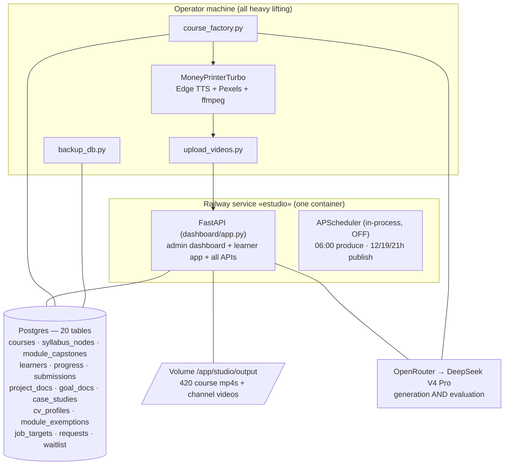

# 03 — Architecture

*Current as of 2026-08-07. Extracted from the code, not from memory — if you
change routes, tables or commands, update this file in the same session.*

## One service, two products



**The split that matters:** the cloud *serves*; the operator machine *builds*.
Course generation and rendering run locally against the same cloud Postgres,
then videos are pushed to the volume through an admin endpoint.

## Repo layout

```
studio/
  channels/*.toml           ← course & channel profiles (SINGLE SOURCE OF TRUTH
                              for name, niche, category, brief, voice, style)
  research/*.md             ← deep-research input, one per course
  cloud/
    db.py                   ← schema, migrations, every Postgres helper
    writer.py               ← EVERY LLM call (generation + evaluation)
    course_factory.py       ← pipeline CLI (10 commands)
    invites.py              ← learner invite codes
    upload_videos.py        ← push rendered mp4s to the cloud volume
    backup_db.py            ← offsite JSON.gz export of all learner data
    producer/publisher/scheduler.py ← social channels (dormant)
    entrypoint.py           ← container boot: config, init_db, serve
  dashboard/
    app.py                  ← FastAPI app, token gate, admin API, page routes
    learn_routes.py         ← the entire learner API (/api/learn/*)
    static/index.html       ← admin dashboard (single file, vanilla JS)
    static/learn.html       ← learner app (single file, vanilla JS SPA + design tokens)
    static/doc.html         ← public project-document page (paper, print-ready)
    static/caso.html        ← public case-study page (paper)
  generate_batch.py         ← queue/pending/*.json → MoneyPrinterTurbo → output/
  output/<slug>/*.mp4       ← rendered videos (= the Railway volume in prod)
MoneyPrinterTurbo/          ← upstream render engine (clean clone; don't edit)
backups/                    ← local DB exports (git-ignored)
docs/                       ← you are here
```

## Data model

20 tables. Schema and additive migrations both run on every boot via
`db.init_db()` — there is no migration framework, and changes must be
additive (`CREATE TABLE IF NOT EXISTS` / `ADD COLUMN IF NOT EXISTS`).

| Table | Holds | Notable columns |
|---|---|---|
| `courses` | one row per course | `slug`, `title`, `description` (learner-facing), `brief` (internal), `category` (catalog cluster), `status` |
| `syllabus_nodes` | one row per lesson | `module_no/title/description`, `objectives`, `position`, `video_file`, `quiz` JSONB (questions + exercise), `transcript`, `key_points`, `written`, `diagrams`, `explain_prompt`, `status` draft→scripted→rendered |
| `module_capstones` | one reto per module | `scenario`, `deliverable`, `rubric` JSONB |
| `learners` | invite-gated accounts | `email` unique, `invite_code` |
| `learner_sessions` / `login_tokens` / `invite_codes` | auth | 90-day sessions; single-use magic links; multi-use invite codes |
| `progress` | per learner × lesson | `quiz_score` (**never lowered** — `GREATEST`), `completed_at`, SM-2 `review_stage`, `next_review_at` |
| `submissions` | every evaluated piece of work | `kind` explain/exercise/capstone, `content`, `evaluation` JSONB, `flagged` + `flag_note` (operator review), **`prompt_snapshot`** JSONB |
| `access_requests` | learners locked out and waiting for a link | `email`, `learner_id`, `reason`, `resolved_at` (self-clearing) |
| `project_docs` / `case_studies` | per-course portfolio deliverables | `content_md`, stable `share_token` |
| `job_targets` | goal intake: analyzed job postings (docs/08) | `learner_id` **nullable** (anonymous public analyses are demand data), `analysis` JSONB, `active`, `share_token` |
| `goal_docs` | the goal document (docs/09): one deliverable per (learner, job target), compiled across the route | `UNIQUE(learner_id, job_target_id)`, stable `share_token`; served by the same paper page as `project_docs` |
| `cv_profiles` | CV intake (docs/10): one active reading per learner, history kept | `cv_text` is **already contact-stripped**; `analysis` JSONB holds the claims |
| `module_exemptions` | modules the learner skips | `status` declarado→acreditado, `source`, `capstone_submission_id`, `score`. **Deliberately not `progress`** — `completed_at` must keep meaning "they did the lesson" |

`learners` also carries the **transversal project** (`project_name`,
`project_desc`, `goal`): learner-level, declared at orientation, injected into
`evaluate_exercise` as context (empty = byte-identical prompt, so no rubric
bump) and into the goal-document compiler. Capstones deliberately do not receive
it — their scenario is a novel case by design.
| `course_requests` | concierge queue | status new→reviewing→building→published/rejected, `course_slug` |
| `waitlist` | public signups | `email` unique, `motivo`, status |
| `topics` / `publish_log` | social channels | dedup history; publish audit |

### `prompt_snapshot` — why a submission stores its own question

Lesson content is **compiled output** and will be regenerated (better scripts,
clearer exercises). `node_id` alone is therefore a dangling pointer: improve an
exercise and every past submission silently becomes an answer to a question
nobody was asked, evaluated against a prompt that no longer exists — and the
portfolio document, the credibility artifact this product sells, quotes it under
the new heading.

`prompt_snapshot` freezes the instruction/question as the learner saw it, at
submit time. It is what makes content safely mutable. Rows predating the column
were backfilled from current content and carry `"reconstructed": true` — a guess
presented as a guess, never as a record.

### The `evaluation` JSONB — read this before touching scoring

Its shape **depends on the submission kind**, deliberately:

```jsonc
// kind = "explain"  — a COMPREHENSION CHECK: verdict, never a score
{ "verdict": "lo_tienes|casi|todavia_no", "feedback": "...",
  "misconception": "..."|null, "missing": ["..."], "rubric_version": 2 }

// kind = "exercise" | "capstone"  — a WORK PRODUCT: scored
{ "score": 0-100, "passed": bool, "rubric_version": 2,
  "dimensions": {"aplicacion": 0-40, "criterio": 0-30, "ejecucion": 0-30},
  "feedback": "...", "misconception": null, "missing": ["..."], "improve": "...",
  "predicted": 0-100,                       // optional learner self-assessment
  "defense_question": "...",                // the ownership probe
  "defense": {"question","answer","bonus":0-10,"comment","missing":[]},
  "defense_attempts": 3, "defense_best": 9, "defense_best_answer": "...",
  "final_score": min(100, score + defense_best) }
```

Rules encoded here, all of them learned from production incidents:

- **Explains carry no number.** Scoring a conceptual explanation on "is it
  grounded in your business" punished correct answers (see doc 02).
- **`rubric_version`** is stamped on every evaluation; the retry prompt only
  quotes a previous score from the *same* version. A cross-version comparison
  once made the tutor write *"subiste de 65"* above a **55**.
- **`final_score` uses `defense_best`**, never the latest bonus, and
  `defense_best_answer` is what the document compiler quotes.

## API surface

**Learner** (`/api/learn/*`, session cookie; `learn_routes.py`):

| Group | Endpoints |
|---|---|
| Auth | `POST /login` · `GET /enter` · `POST /logout` · `GET /me` (carries the transversal project) |
| Public (no auth) | `GET /public/catalog` · `GET /public/course/{slug}` · `POST /waitlist` · `POST /public/job-analysis` · `GET /public/ruta/{token}` · `GET /doc/{token}` · `GET /caso/{token}` |
| Home | `GET /today` — continue-card, due reviews, pending conversations, streak |
| Courses | `GET /courses` · `GET /course/{slug}` · `GET /lesson/{node_id}` · `GET /video/{node_id}` · `POST /complete` |
| Evaluation | `POST /submit` (explain\|exercise; identical text is **never re-graded** and the response carries `best_score`) · `POST /defend` · `POST /reteach` (re-teach on a failed verdict; not stored, not scored) · `GET /capstone/{id}` · `POST /submit-capstone` |
| **Goal** | `GET /job-target` (active target, per-course `route`, **and `steps` — the route as an ordered path of module-level capabilities**, each with its `exempt` state) · `GET /job-targets` (history) · `POST /job-target/claim` (claim **and** switch) |
| **CV** (docs/10) | `POST /cv` (read a CV → proposed module exemptions) · `GET /cv` · `DELETE /cv` · `POST /exemption` (`skip`\|`teach`). Session-gated on purpose: unlike the job analyser, a CV has no acquisition value and every reason to stay attached to one account |
| Portfolio | `GET/POST /goal-doc` · `GET/POST /project-doc/{slug}` · `GET/POST /case-study/{slug}` · `GET /portfolio` |
| Concierge | `POST /request` · `GET /requests` |
| Profile | `GET /profile` · `POST /profile` (declare the transversal project) |

`POST /public/job-analysis` is **session-aware**: anonymous callers get an
unattributed target and the per-IP budget (3/h); authenticated callers get the
target attributed immediately but **inactive** (a candidate they must accept),
their route progress previewed, and the per-learner evaluation budget.

**Admin** (token-gated by middleware; `app.py`): `/api/state`, `/api/jobs/{job}`,
`/api/videos/*`, `/api/upload-media`, `/api/delete-media`, `/api/learners`,
`/api/learners/{id}/login-link`, `/api/learners/{id}/work`,
`/api/submissions/{id}/flag`, `/api/waitlist`, `/api/requests`, `/api/demand` (gap ledger + module coverage), `/api/access-requests` (locked-out learners), `/api/invites`
(list/create), `/api/invites/{code}/toggle`.

> **The gate is an allowlist** (`studio/dashboard/admin_paths.py`). A new admin
> route that is not added to it ships **public**. Two routes nearly did on
> 2026-08-12, one of them the invite-code list. Add the prefix in the same edit,
> add a row to `check_public_surface.py`'s audit, and curl it tokenless before
> deploying. The predicate is a pure function in its own module precisely so the
> audit can import it without FastAPI and cannot be skipped by accident.

**Pages.** Three surfaces, three roots (docs/11):

| URL | Surface | Gate |
|---|---|---|
| `/` · `/oferta` · `/lista` · `/curso/{slug}` | the public site | none — server-rendered `<title>`/OG per route |
| `/aprende` and its hash routes | the learner app | session cookie |
| `/panel` | the operator dashboard | `DASHBOARD_TOKEN` |

`/` used to be the dashboard, which meant the root of the product returned **401**
to anyone who typed the domain while the public surfaces had no addresses at all
(`/oferta` was a 404 though docs/08 calls it the acquisition asset). `_spa_shell`
serves the same SPA shell per route with injected metadata and the view to open
on; `route()` falls back to it when there is no hash.
`check_public_surface.py` asserts the allowlist offline and the served behaviour
over HTTP, so the split cannot rot quietly.

**Other pages:** `/aprende/entrar`,
`/aprende/doc/{token}`, `/aprende/caso/{token}`, `/aprende/ruta/{token}` — the
share pages inject server-side OG tags because link-preview crawlers don't run
JS. `/aprende/doc/{token}` serves **both** per-course and goal documents
(`db.doc_by_token`); only the credit line differs.

## Frontend

Both UIs are still **single vanilla-JS files**, and both are being replaced.
**There is a build step as of 2026-09-02** — Astro emitting static files from
`studio/web/`, run in Docker stage 1, copied into the image. Node exists at build
time only; production is the same single Python process it always was. The cause
was a bug, not a preference: hand-written server-side prerendering produced a
visible seam between the served document and the hydrated one, because the two
were never the same document, and four fixes did not close it. See PRODUCT.md for
the decision and its cost, and the phased plan for what has actually moved.
Phase 1 (the scaffold) ships the pipeline and **moves no route**.

`learn.html` is the learner SPA: a **CSS token layer** (`:root` — colors, a
six-step type scale, spacing, radii, motion) plus component classes, an inline
**SVG icon set** (`PATHS` + `I()`), and a **hash router**
(`#/hoy`, `#/cursos`, `#/curso/{slug}`, `#/leccion/{id}[/{explica|quiz|ejercicio}]`,
`#/reto/{id}`, `#/objetivo`, `#/portafolio`, `#/documento/{slug}`,
`#/caso-view/{slug}`, `#/perfil`, plus public `#/`, `#/explora/{slug}`,
`#/lista`, `#/login`). **`#/oferta` is routed in BOTH branches** — a logged-in
learner who finds a new offer must be able to analyse it; it lived only in the
public branch at first, which made the "Pega tu oferta" button inside
`#/objetivo` a dead end. Visual changes belong in the token block, never in
element styles.

The tests live in `studio/web/tests/` and run under vitest — **114 assertions**,
`cd studio/web && npm test`. Four suites cover the vanilla SPA by extracting its
script block and running it against a shared DOM shim (`harness.js`); a fifth
(`tokens.test.js`) fails the build if `learn.html`'s inline `:root` drifts from
`src/styles/tokens.css` while both copies exist, and is deleted with `learn.html`.
The shim asserts its own substitution succeeded — a silently-empty harness once
reported a clean pass, which is the failure mode `docs/07` warns about. They are
DOM-shim rather than browser based because the browser pane wedges often enough
that `docs/07` names this as the fallback.

The lesson **step deep-links exist for a reason**: a pending conversation shown
on Hoy must land exactly on the step where it can be answered. Without them,
completed lessons skipped the explain step and the conversation was unreachable.

## Request flows worth knowing

**Access control.** `accessible = completed lessons + the first uncompleted one`,
recomputed per request. Enforced on `GET /lesson`, `GET /video` and `POST /submit`.
`is_review` comes **only** from the server.

`_accessible_for` is the single place it is computed, and it applies two
wideners — the active route's module set (docs/09) and the learner's module
exemptions (docs/10). Both only ever ADD: a skipped module stays exactly as
reachable as before, what moves is where we *start* them. Consolidating matters
because this codebase's recurring shape is a rule that reached some gates and
not others (docs/07, "security by allowlist").

**Evaluation.** `POST /submit` → access check → per-learner rate limit
(`EVAL_RATE_MAX`, default 60/h) → the previous attempt is fetched and passed to
the evaluator (for progress recognition **only** — the prompt insists on grading
the new text alone) → stored in `submissions`. Nothing here gates progression.

**Best-attempt-wins.** `db.best_submissions()` (highest
`COALESCE(final_score, score)`) feeds every surface that *shows* a score and the
document compiler. `db.latest_submissions()` feeds "current state" (pending
conversations, textarea prefill). Confusing the two re-introduces score
regressions — check which one you need.

**Document compilation.** `_course_submissions()` collects the learner's *best*
exercise and capstone work (explains are excluded — they are not work products)
→ `writer.compose_project_doc` with per-course section templates → upsert with a
stable share token → public paper page.

## Security model

Two front doors: the admin surface behind a single `DASHBOARD_TOKEN`
(middleware, `_is_admin_path`), and the learner surface behind a session cookie.
Public surfaces: landing/catalog/temarios, login (rate-limited 8/5min per IP + honeypot),
waitlist (same), and share pages where an unguessable token is the capability.
Per-learner evaluation rate limiting. No payments and no third-party trackers.

**PII: name, email, and — since 2026-08-26 — an optional CV** (docs/10), stored
with emails and phone numbers stripped at ingest, kept off every admin surface,
and deletable by the learner from the screen that collects it. Real CVs used for
calibration never enter the repo: `.gitignore` blocks `*.pdf` and `cvs/`.

**Hardened 2026-08-12** after a full audit that exploited four of these in
production. What now holds, and what each replaced:

| Control | Rule |
|---|---|
| **Progression gate** | every `progress` write runs `_accessible_ids`; `/complete` derives `is_review` from `completed_at` and clamps `quiz_score` to 0–1. A write that grants a read is an access decision (docs/07). |
| **Account entry** | an existing account is enterable only by proving inbox control. Without `RESEND_API_KEY`, self-service re-login returns **409** and the operator mints the link (docs/05 lockout runbook). Invite codes create accounts; they do not enter them. |
| **Sessions** | expiry lives in `learner_sessions.expires_at`, checked server-side; `/logout` deletes the row; expired sessions and spent magic links are purged on boot. |
| **LLM inputs** | all learner text is wrapped by `writer._fenced()` and every evaluator/compiler system prompt carries `UNTRUSTED_RULE`. Model output is still recomputed server-side (scores clamped, dimensions summed). |
| **CV claims** | a CV is untrusted text whose literal purpose is to request privilege, so its ceiling is a *proposal*: only passing a module's reto changes anything. Unknown slugs/modules are dropped and **every quote is verified to be in the CV** — the model paraphrased on the first real document and a paraphrase shown as "esto que escribiste" is a fabricated credential (docs/10). |
| **Untrusted Markdown** | `renderMD()` = marked → DOMPurify. Never `innerHTML = marked.parse(...)`. CDN libs pinned exactly + SRI. |
| **Admin gate** | fails **closed** in production (503 if `DASHBOARD_TOKEN` is unset on Railway), constant-time compare, `Secure` cookies. Locally an empty token still means open — the documented dev loop. |
| **Headers** | CSP, HSTS, `nosniff`, `frame-ancestors 'none'`, Referrer-Policy, Permissions-Policy on every response. CSP still needs `'unsafe-inline'` for scripts (single-file frontends), so **DOMPurify is the real XSS control**, not CSP. |
| **Recon** | `/docs`, `/redoc`, `/openapi.json` disabled in production. |

Rate limiting is per-IP via `X-Forwarded-For`'s first hop. Railway's edge
**overwrites** that header, so it is not client-spoofable here — tested. That
guarantee belongs to the proxy, not to the code: behind a different proxy, or
exposed directly, `_client_ip` becomes attacker-controlled.

## Design decisions and their reasons

| Decision | Why |
|---|---|
| **TOML profiles are the single source of truth**; `ensure_course` upserts on every factory command | Editing a file beats editing a database; hand-patched rows rot (proven twice) |
| **Verdicts for comprehension, scores for work products** | One rubric across three kinds of work was a category error that punished correct explanations |
| **`rubric_version` on every evaluation** | Comparing scores across rubric versions made the tutor contradict itself in front of a learner |
| **Best attempt always wins** (submissions, quiz scores, conversation bonus) | Retrying must never be a gamble, or "try again" is dishonest |
| **Videos canonical per lesson; personalization in the path** | Marginal cost per learner ≈ 0 |
| **Astro + Svelte islands, static output, built in Docker stage 1** | Replaces hand-written prerendering, whose served and hydrated documents could never be made identical; Node stays out of production |
| **Tokens in one real stylesheet** (`studio/web/src/styles/tokens.css`) | A visual change is still one token edit — now by construction rather than by convention |
| **Evaluations formative; gates on engagement, not passing** | Completion is the metric that kills edutainment products |
| **Reward appropriation, don't police AI** | AI detection is unreliable and contradicts a curriculum that teaches AI use |
| **Verification = counting rows, not exit codes** | A pipeline once reported success while producing zero lessons |
