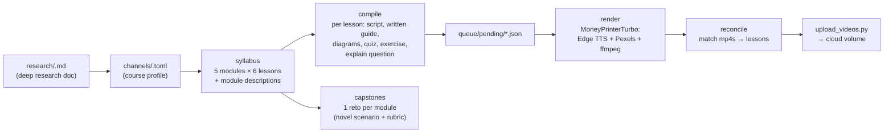

# 04 — The course factory: research in, course out

The factory turns a research document into a complete course: syllabus, 30 lessons
(video script + written guide + diagrams + quiz + exercise + comprehension
question), per-module capstones, and rendered videos. Total cost ≈ $0.35 of LLM
plus ~2 hours of local render compute.

## The pipeline



```bash
python studio/cloud/course_factory.py <slug> preflight   # VALIDATE FIRST — exits non-zero
python studio/cloud/course_factory.py <slug> verify      # count rows — exits non-zero
python studio/cloud/course_factory.py <slug> syllabus    # generate/print the DAG
python studio/cloud/course_factory.py <slug> compile     # write all lessons
python studio/cloud/course_factory.py <slug> render      # render queued videos
python studio/cloud/course_factory.py <slug> reconcile   # match mp4s to lessons
python studio/cloud/course_factory.py <slug> capstones   # per-module retos
python studio/cloud/course_factory.py <slug> all         # end-to-end
python studio/cloud/course_factory.py <slug> sync        # push TOML copy to DB
python studio/cloud/course_factory.py <slug> status      # node status summary
# backfills for courses created before a feature existed (all idempotent):
python studio/cloud/course_factory.py <slug> backfill-text     # transcript + key_points
python studio/cloud/course_factory.py <slug> backfill-written  # written guide + diagrams
python studio/cloud/course_factory.py <slug> check-narration  # flag page-only devices (exit != 0)
python studio/cloud/course_factory.py <slug> backfill-explain  # per-lesson explain_prompt
python studio/cloud/course_factory.py <slug> backfill-modules  # module_description
python studio/cloud/course_factory.py <slug> backfill-prereqs  # module_prereqs (docs/09)
python studio/cloud/course_factory.py <slug> fix-titles        # Spanish sentence case
```

**`preflight` and `verify` are the two that matter**, and both exit non-zero so a
script can gate on them (`all` runs preflight first and ends in verify).
`preflight` checks every required TOML field, `niche` length, that the title
carries **no duration claim**, that the category is in `CATEGORIES`, that the
voice and stroke colour are unused *by another course*, that the research file
decodes as clean UTF-8 and is long enough, and that `PROJECT_TEMPLATES` has an
entry. Every check corresponds to something that actually went wrong once. Both
earned their keep the day they shipped: preflight found three live courses
sharing one voice, and verify caught a course silently at 29/30 because a single
lesson failed compile validation.

**The judgment these commands can't make lives in
`.claude/skills/course-factory/SKILL.md`** — is the research good enough, what is
this course's deliverable, and does the business-shaped `Aplicación` rubric fit
this domain.

Every command is **idempotent**: existing nodes/capstones/descriptions are kept,
missing ones are generated. Re-running is always safe — that is the recovery model.

## Stage by stage

### 1. Research (the quality ceiling)

A course is as good as its research document. The bar, learned from the best ones:

- **Current** — ad platforms and AI search change quarterly; the doc must be dated
  and web-grounded.
- **Evidence-classified** — the SEO research pioneered the house standard: every
  statistic tagged **P** (primary source), **V** (vendor study), or **X**
  (unverifiable — discarded). The course then *teaches* that discipline.
- **Operational** — steps, numbers, costs, errors; not think-pieces.

Research docs come from deep-research runs (prompts are crafted per course) or are
written in-session grounded in current web sources. They are injected verbatim
into syllabus and lesson generation as authoritative material with an explicit
"do not contradict or invent beyond this" instruction.

### 2. The course TOML (identity)

```toml
kind = "course"
name = "Meta Ads"                       # learner-facing title, NO duration claim
slug = "curso-meta-ads"
niche = "De cero a campañas rentables…" # learner-facing promise, ≤110 chars
category = "Publicidad digital"         # catalog cluster (groups the catalog)
audience = "…"                          # who it's for (steers generation)
tone = "Profesora práctica: …"          # voice of the course
cta = "Ahora hazlo tú: …"               # closing line of every video
course_brief = "…"                      # INTERNAL generation spec, never shown
research_file = "meta-ads.md"
[voice]  # Edge TTS voice + rate        [style]  # subtitle font/colors, 9:16
```

Current categories: *Marketing y contenido*, *Publicidad digital*,
*IA y automatización*. Keep them coarse — a category with one course looks
broken. Unknown values fall into a "Más cursos" bucket rather than breaking.

`name`/`niche` are learner-facing; `course_brief` drives generation only. The
factory upserts all three into Postgres on every command — **the TOML is the
single source of truth**; nobody edits course copy in SQL.

### 3. Syllabus

One LLM call → 5 modules × 6 lessons, each with a slug, title, measurable
objectives ("what the learner can DO after"), an angle, and a per-module outcome
description. Strict progression: each lesson assumes only what came before.

### 4. Compile (the big one)

One LLM call per lesson produces, in a single JSON:

- `script` — 110–140 words for a 45–60s video: hook → one concept with one real
  example → recap → exercise CTA. The video carries the *why*.
- `written` — a Markdown how-to (numbered steps, comparison tables): the *how*,
  better read than watched. `diagrams` — 0–2 Mermaid diagrams when structure
  beats prose.
- `key_points` + the script doubles as `transcript` (readable lesson).
- `explain_prompt` — the lesson-specific comprehension question (never generic).
- `quiz` — 3 MCQs where every wrong answer's explanation teaches.
- `exercise` — a 5–15 minute task producing a real artifact, with a copy-paste
  starting prompt; framed for the learner's own business **or a real known brand**.

All generation obeys the **VOICE_GUIDE**: a real person teaching, tú-form,
concrete numbers, honesty about effort, and a banned-word list (potenciar,
desbloquear, revolucionar, "de alto impacto", tricolons, em-dash abuse…). Titles
in Spanish sentence case. The guide is injected into *every* LLM call, including
evaluations — the tutor and the course speak with one voice.

### 5. Render

`generate_batch.py` feeds each queued lesson to the MoneyPrinterTurbo engine:
Edge TTS narration (per-course neural voice), Pexels stock footage matched to
per-beat English search terms, ffmpeg assembly with per-course subtitle styling,
9:16 vertical. ~2 min/video locally.

### 6. Capstones

One call per module: a novel LatAm business scenario (name, product, budget,
constraint) that **must not reuse lesson examples**, a concrete deliverable that
fits in a text box, and a 3–4 criterion rubric for the evaluator.

## The evaluation layer (writer.py, runtime)

The same module powers the live tutor:

| Function | Returns | Judged against |
|---|---|---|
| `evaluate_explanation` | **verdict** (`lo_tienes`/`casi`/`todavia_no`) — never a score | lesson objectives + transcript + the exact question |
| `evaluate_exercise` | score /100 + 3 dimensions + a conversation question | the exercise instruction + lesson content |
| `evaluate_capstone` | same as exercise | scenario + rubric, criterion by criterion |
| `evaluate_defense` | bonus 0–10 + what a 10 would add | the artifact + the question asked |
| `compose_project_doc` | the course's client-grade deliverable, from the learner's **best** work |
| `compose_case_study` | the STAR narrative companion |

Two contracts, deliberately **not** merged (merging them was a real bug):

- `EXPLAIN_JSON_SPEC` — a comprehension check. Explicitly forbids demanding
  business data; "generic but correct" is a pass; if the question asked *why*
  and the learner answered *what*, that's `casi`.
- `EVAL_JSON_SPEC` — a work product. Dimensions **Aplicación** 0–40 /
  **Criterio** 0–30 / **Ejecución** 0–30 that *are* the score, feedback quoting
  the learner's own text, a `missing` list, and a `defense_question`.

Both stamp `rubric_version`; retry prompts only compare scores within a version.
**`check_tutor.py` is the regression test for all of it** (6 cases, real LLM calls):
stability on identical input, ordering, that acting on `missing` raises the score,
the non-attempt floor, injection resistance, and the explain/work contract split.
Composition contract: **nothing invented** — gaps become labeled "Por
desarrollar", unproven results become projections.

## Costs & timings (measured, not estimated)

| Stage | Time | Cost |
|---|---|---|
| Syllabus | ~1 min | ~$0.01 |
| Compile 30 lessons | 30–60 min | ~$0.25 |
| Capstones (5) | ~5 min | ~$0.03 |
| Render 30 videos | ~60–90 min local | $0 (Pexels free tier) |
| Upload to volume | ~10 min | $0 |
| **Full course** | **~2–3 h wall clock, mostly unattended** | **≈ $0.35** |

## Failure modes (all hit in production, all handled)

- **Pexels 200 req/hr** → renders >~30 videos need multiple passes. The queue is
  idempotent; pipelines chain a second render+reconcile pass by default.
- **Railway's public DB proxy kills long connections** → the factory reconnects
  per lesson; `writer._chat` retries transient OpenRouter drops with backoff.
- **A single invalid byte in a research file once zeroed a course silently**
  (UnicodeDecodeError → pipeline logged "done") → the reader now decodes with
  `errors="replace"`, and batch verification means **counting DB rows, never
  trusting exit codes**.
- **Rare single-lesson render failures** (upstream edge case) → reset the node to
  draft (`status='draft', video_file=NULL`), recompile+render; fresh scripts render fine.
- **Windows locale double-encoding accents** → `db.connect()` forces
  `client_encoding=utf-8` everywhere; keep it.
