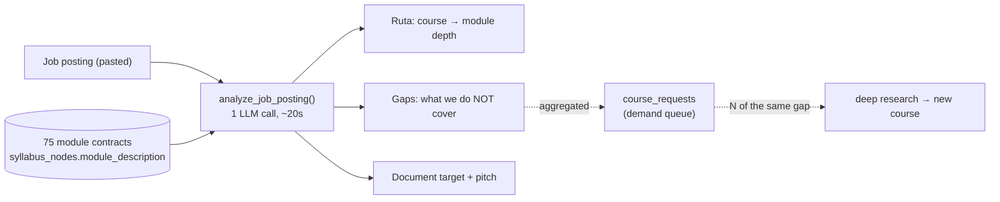

# 08 — The job target: from a job posting to a study plan and a document

*Spec. Written 2026-08-07, before implementation, so the contract exists before
the code does. Update it in the same session as any change to the contract.*

## Why this exists

The strongest thing that ever happened to this platform happened by accident:
**a real job posting became the course roadmap.** the design partner's target role (semi-senior
content / e-commerce marketer) decomposed into copywriting, SEO+AEO, Meta and
Google ad formats, and Klaviyo-style email flows — and that decomposition is
literally the current seven-course lineup.

That is a repeatable acquisition product:

> **"Pega la oferta de trabajo que quieres. Te armamos el plan de estudio y el
> documento que vas a llevar a la entrevista."**

It converts the vaguest possible motivation (*aprender IA*) into the sharpest
one (*conseguir este trabajo*), every posting is a real high-intent query, and
the deliverable — the portfolio document — is already built.

This is **not an extra feature**. It is intended to become the front door and
the organizing metaphor, with the course catalog demoted to the browse surface
beneath it. It also settles the positioning ambiguity flagged in doc 06: not
"Rumbo", but *el plan y el portafolio para el trabajo que quieres*.

## The decision that defines the design: two clocks

The tempting implementation — *posting → deep research → generate a custom
course* — is wrong, and expensively so. It costs 2–3 hours plus a render queue
per posting, so it can never be self-serve or live on a landing page; it puts us
back in supply manufacturing when the constraint is demand (doc 06); and it
duplicates what we own, because any posting will overlap the existing library
heavily.

Two clocks run instead, and they must never be coupled:

| | **Supply clock** | **Demand clock** |
|---|---|---|
| Trigger | N postings demand the same missing competency | one person pastes one posting |
| Process | deep research → `course_factory` | parse → match → assemble |
| Cost / latency | ≈ $0.35, 2–3 h, unattended | fractions of a cent, ~20 s |
| Output | new lessons in the library | a **ruta** + a **document target** |
| Owner | operator, deliberate | self-serve, instant |

The reframe that makes it work: **the course was never the unit — the lesson
is.** We built a 210-lesson competency library and shipped it packaged as seven
courses. The job posting is the recombination key. Deep research keeps doing
exactly what it does today; it just leaves the critical path of a user request.



## Routes are module sets, gated by declared prerequisites (spec v2)

*(v1 constrained routes to per-course prefix depths because access was strictly
sequential. Superseded 2026-08-12 — kept here as history.)*

A route entry now selects a **module set** (`"modules": [1, 3]`), not just a
depth. What makes skipping safe is **prerequisites as data** (docs/09 item 2):
every module carries `module_prereqs` — the earlier modules its lessons
genuinely assume — extracted per course by `course_factory <slug>
backfill-prereqs` with a deliberately **conservative** bias (over-declaring
degrades to the old prefix behavior; under-declaring strands a learner in a
lesson that says "como vimos en el módulo 2").

Three enforcement points, none of which trust the model:

1. **`_normalise_job_analysis` closes every selection over prereqs,
   transitively** (`_close_over_prereqs`). A module whose prereqs were never
   extracted (`NULL`) falls back to strict sequence — exactly the old behavior.
2. **Coverage claims must name a module inside the selected set.**
3. **Access widens, never narrows** (`_accessible_ids`): a routed learner gets a
   mid-course entry point — the first uncompleted lesson within the selected
   modules — in addition to the normal sequential gate. Learners without a
   route are byte-identical to before.

`module_description` (the "contrato de resultado") plus `module_prereqs` are the
matching inputs; the catalog block shows each module's `requiere:` list to the
model, and the fixture suite asserts prereq closure as a universal invariant.

## The contract: `writer.analyze_job_posting`

One call, `_chat` + `_extract_json` like everything else in `writer.py`, with
`VOICE_GUIDE` injected so the output speaks in the platform's voice.

```jsonc
{
  "role_title": "…",          // normalised title read off the posting
  "company": "…"|null,        // only if the posting names it
  "seniority": "junior|semi-senior|senior|no-especificado",
  "competencies": [           // what the POSTING demands, before any matching
    {"name": "AEO para e-commerce", "evidence": "cita literal de la oferta"}
  ],
  "ruta": [                   // ONLY courses that genuinely serve a competency
    {"course_slug": "curso-seo-aeo",
     "modules": [1, 3],       // v2: a module SET, prereq-closed server-side
     "through_module": 3,     // derived: max(modules), kept for v1 consumers
     "phase": "nucleo|despues",     // núcleo = what you do before you can apply
     "course_title": "…", "lessons": 12,   // derived: lessons in selected modules
     "covers": [{"competency": "…", "module_no": 3}],  // must be in `modules`
     "why": "una frase, en tú, dirigida a la persona"}
  ],
  "gaps": [                   // demanded by the posting, NOT in the library
    {"name": "Herramientas de planificación (Trello, ClickUp, Notion)",
     "evidence": "…", "severity": "alta|media|baja"}
  ],
  "coverage": 0-100,          // derived: (competencies - gaps) / competencies
  "doc_type": "…",            // the interview deliverable — "" when we can't serve the role
  "doc_title": "…",           // "Propuesta para <empresa>: …"
  "pitch": "…",               // one line the learner can say in the interview
  "total_lessons": 0,         // derived
  "core_lessons": 0,          // derived: the núcleo only
  "spec_version": 1
}
```

**Phased routes.** An honest route for a broad posting runs ~120 lessons, which
is correct and unstartable. `phase` splits it: the **núcleo** is **where you
start — at most 2 courses**, the ones covering what the posting emphasises most.
Everything else is `despues`. The route is sorted núcleo-first.

Constrain the núcleo, never the total. Truncating the total would lie about what
the job needs. But the núcleo was first specified as *"the minimum to be job
ready"*, and calibration showed that is genuinely ~2/3 of the whole route (84 of
126 lessons on the design partner's posting) — technically true and useless, because nobody
opens an 84-lesson plan. The núcleo answers "where do I start", not "when am I
ready".

**The coverage floor is server-side.** Below `JOB_COVERAGE_FLOOR` (25), or with
an empty route, `doc_type` / `doc_title` / `pitch` are **cleared in
`_normalise_job_analysis`**, not left to the UI. This is not theoretical: the
first calibration run correctly refused to route a data-engineering posting and
then invented a *"Diseño de arquitectura de pipeline de datos"* deliverable with
a pitch promising Spark and Terraform. A fabricated promise on an
unauthenticated public page is the worst failure this feature has.

**Rules the prompt must enforce**, each one a failure mode we can already name:

- **Never invent coverage.** A competency the catalog does not serve goes in
  `gaps`, never in `ruta`. The model has a standing incentive to flatter our own
  catalog; the prompt fights it explicitly and the fixtures test for it.
- **Depth must match the demand.** the design partner's posting says *"aunque no seas el
  encargado directo de gestionar el presupuesto o pauta"* — that asks for ad
  **formats**, not campaign management, so the correct answer is a shallow
  prefix of the ads courses, not all five modules. Over-prescribing depth is the
  same failure as over-claiming coverage: it makes the plan unachievable and the
  promise dishonest.
- **`through_module` is an integer 1–5**, and every named `course_slug` must
  exist in the catalog passed in. Validate both server-side; drop unknown slugs
  rather than trusting the model.
- **`coverage` is a claim about us, not about the candidate.** It never scores
  the person. Nothing in this feature evaluates whether someone is good enough
  for a job.

## Schema

`project_docs` is `UNIQUE(learner_id, course_id)` with a `NOT NULL` FK to
`courses`, so a cross-course document does not fit it. This is the only real
schema work; additive as always (`CREATE TABLE IF NOT EXISTS`).

```sql
CREATE TABLE IF NOT EXISTS job_targets (
    id SERIAL PRIMARY KEY,
    learner_id INT REFERENCES learners(id),   -- NULL = anonymous public analysis
    posting_text TEXT NOT NULL,
    role_title TEXT NOT NULL DEFAULT '',
    company TEXT NOT NULL DEFAULT '',
    analysis JSONB NOT NULL,                  -- the contract above, verbatim
    active BOOLEAN NOT NULL DEFAULT false,    -- the learner's current target
    share_token TEXT UNIQUE,
    created_at TIMESTAMPTZ NOT NULL DEFAULT now()
);
```

`learner_id` is **nullable on purpose**: the analysis happens *before* login (see
below), and an anonymous row is still a demand signal worth keeping.

The job document (stage 3) gets its own row rather than overloading
`project_docs`; `compose_project_doc`'s contract is unchanged, it just needs a
template that is not keyed by course slug.

## API surface

| Endpoint | Auth | Notes |
|---|---|---|
| `POST /api/learn/public/job-analysis` | **none** | rate-limited per IP + honeypot, same shape as `/waitlist` |
| `POST /api/learn/job-target` | session | save/activate an analysis for a learner |
| `GET /api/learn/job-target` | session | the active target + live progress against the ruta |

The public endpoint is the whole point and must not slip behind auth. A stranger
pastes a posting, gets the ruta, the honest gap list, and a preview of the
document they would walk in with — **and only then** meets the invite/waitlist
wall, at peak intent. The concierge does roughly this today, sits behind auth,
and has zero rows.

## Calibration (doc 07 discipline applies)

**Do not author your own fixtures.** The rubric bug survived because it was
validated against examples written by the person who wrote the rubric.

The starting fixture set, checked into the repo:

1. **the design partner's real posting** (`studio/fixtures/job-postings/real-content-ecommerce-latam.txt`)
   — broad marketing role. Measured: **83% coverage, núcleo 54 of ~110 lessons,
   one gap** (Trello/ClickUp/Notion), ads courses correctly deferred and stopped
   short of their budget modules, citing the posting's own *"aunque no seas el
   encargado directo de gestionar el presupuesto"*.
2. **An adversarial out-of-coverage posting** — a senior data-engineering role.
   **Pass condition: `coverage` ≤ 20, empty `ruta`, honest `gaps`, and an empty
   document.** This is the degenerate case doc 07 demands.
3. Real postings collected during stage 0 (below), added as they arrive.

**A fixture expectation was wrong and the data corrected it.** The first version
expected organic social-media management as a gap. It is not one:
`curso-marketing-ia` M3 covers *"posts para redes … planificarás un mes entero de
contenido"*, which is what the posting asks for. The assertion had also been
passing by accident — a substring test for `"red"` was matching `"Redacción"`.
Fixtures answer to the catalog, not the reverse; use word-boundary matching.

**Expect run-to-run variance.** Module depths move by one across runs and the
total route drifts (~102–114 lessons observed). Assert on properties — coverage
band, núcleo size, gap presence, no module-5 on ads — never on exact numbers.

## Checks to run before shipping a change here

```bash
# the matcher, against all four postings (~15 min, real LLM calls)
DATABASE_URL=… OPENROUTER_API_KEY=… LLM_MODEL=… \
  python studio/cloud/check_job_matcher.py

# the result page renders (fast, no network — DOM shim per docs/07)
cd studio/web && npm test    # job-render.test.js \
  studio/web/src/components/JobAnalyser.svelte \
  studio/fixtures/job-postings/sample-analysis.json
```

Run the matcher check after ANY edit to `JOB_MATCH_SYSTEM`, `JOB_JSON_SPEC` or
`_normalise_job_analysis`, and the render check after any edit to
`renderJobResult`. Neither has another regression test, and both failure modes
are silent.

## Staging

| Stage | What | Ships value |
|---|---|---|
| **0** | Run it **by hand**. Offer it publicly, do ~10 postings manually. | Demand evidence + the fixture set. Costs nothing. |
| **1** | Public analyzer: paste box → ruta + gaps + doc preview → capture. | **The acquisition asset.** Ships standalone; the ruta can deep-link into existing temarios. |
| **2** | The ruta drives the Hoy tab instead of "most recent course". | Retention |
| **3** | The job document: one deliverable assembled across courses, aimed at one interview. | The endgame |

Stage 1 is the growth payload and does not require 2 or 3. Stage 0 is worth more
than either and should run in parallel regardless of build progress.

## What this changes about the transversal project

Today lesson 1 asks the learner to choose their own business **or** a real known
brand. With a job target set, there is a third and better option: **the company
they are applying to.** Every exercise then feeds an unsolicited proposal for
that specific employer. That is a prompt-framing change on existing exercises,
not new content.

## Risks

| Risk | Mitigation |
|---|---|
| **The gap problem** — real postings will demand HubSpot, Klaviyo by name, Amazon Ads, Power BI, community management | Frame as *"esto pide el puesto · esto cubrimos · esto no"*. Honesty is already the brand (doc 01). Decide a coverage floor below which no ruta is shown at all. |
| **Motivated reasoning toward our own catalog** | Explicit prompt rules + the adversarial fixture. Never ship a prompt change without re-running both fixtures. |
| **Pulls us back into supply manufacturing** | **Instrumented 2026-08-12:** `GET /api/demand` (admin) aggregates every analysis's gaps with recurrence counts and surfaces `build_candidates` only past `GAP_BUILD_THRESHOLD` (default 3). It also reports how many library modules no route has EVER selected — 43 of 70 at the time of writing, which is the argument against building more, not for it. Build course N when the same gap recurs **and** someone has finished a ruta. |
| **Better hook, same leaky bucket** | This is acquisition, not activation. Lesson 1 still took the design partner 46 hours and 5 submissions. Do not mistake a full funnel top for a working product. |
| Scraping job boards | Out of scope. Learners paste their own postings; we do not crawl. |
