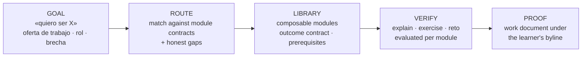

# 09 — The world of knowledge: "quiero ser X" and we handle the rest

*North star, written 2026-08-11. This is where the product is going. Doc 01 is
still the thesis; this is the shape the thesis takes at scale.*

## The one sentence

> A learner says **"quiero ser X"** — a role, a job posting, a skill they are
> missing — and the platform assembles the route, teaches it, verifies they
> learned it, and hands them the work product that proves it.

Doc 01 said the defensible half is *verifying* learning and turning it into
proof. That still holds. This document adds the half in front of it:
**composing the path**. Generating content is commodity; composing a credible
route through it and certifying the output is not.

## Three layers

| Layer | State today |
|---|---|
| **Goal intake** | **Shipped.** Job posting *or* bare role/skill (`analyze_job_posting`, `mode="goal"`). |
| **Route** | **Shipped.** Prereq-closed module SETS, spec v2. |
| **Library** | **14 courses / 420 lessons**, every module carrying declared prerequisites. |
| **Verify** | Shipped and mature — the best part of the system. |
| **Proof** | **Shipped per goal**, compiled across the whole route. |

## The unit problem *(solved 2026-08-12 — kept as the reasoning)*

The platform used to hold three disagreeing ideas of what a unit is:

| | Unit | Then | Now |
|---|---|---|---|
| **Product** | the course — 30 lessons, one deliverable | title claimed "en 30 días" | duration claim dropped; the route is the promise |
| **Matching** | the **module** — outcome contracts | already module-level | module SETS, prereq-closed |
| **Access** | the **course prefix** | prefix only | route-aware, widening |

Matching already reasons in modules, because that is the natural unit of a
route. Access does not. So a route can only ever be a prefix of a course.

**Presentation was the last holdout, fixed 2026-08-17.** Matching, access and
prereq closure all moved to modules on 2026-08-12 — and every screen kept
rendering courses, so `#/objetivo` showed a bill of materials ("curso-seo-aeo ·
Módulos 1 y 3 · 12 lecciones") and Hoy said "Lección 4 de 30 de Marketing con
IA". The engine reasoned in knowledge; the interface sold courses, which is
exactly how the product read to its own operator. `GET /job-target` now returns
`steps`: one entry per selected module, in route order, labelled by its outcome
contract ("Sabrás pedirle a la IA exactamente lo que necesitas…") with the
course demoted to a provenance line. Hoy leads with the goal and measures the
route. `route` is still returned for the per-course summary.

**Concretely:** an influencer-marketing consultant genuinely needs
`curso-tiktok-ads` M3 (creatividades nativas, Spark Ads). Reaching it requires
M1 and M2 — ad account setup, pixel, purchase-intent audiences — which that role
will never touch. Twelve wasted lessons, and the route reads as padding.

**The course was never the unit. The module is.** "30 días" is a packaging
decision inherited from the first course; the library is really a set of module
contracts, each with an outcome, prerequisites and connections to other domains.

## What has to become true, in order

1. **Content is authored as composable modules.** Every block stands alone,
   declares its real prerequisites, and names what it connects to. *Started:*
   the research prompts from 2026-08-11 onward require a modularity section.
2. ~~**Prerequisites and connections become data.**~~ **Shipped 2026-08-12.**
   `module_prereqs` on every module of all 14 courses, extracted conservatively
   (`course_factory <slug> backfill-prereqs`): over-declaring degrades to prefix
   behavior, under-declaring strands learners. The structures are genuinely
   non-prefix — meta-ads M3 needs only [1]; voleibol M4 (dirección de equipos)
   is fully autonomous.
3. ~~**Access follows the route.**~~ **Shipped 2026-08-12.** Routes are module
   SETS (spec v2), prereq-closed transitively server-side; `_accessible_ids`
   widens — never narrows — with a mid-course entry point once a selected
   module's prereqs are done. Enforced at temario/lesson/video/submit. Measured
   effect on the design partner's real posting: the honest route dropped from
   ~120 to 84 lessons with zero loss of depth where a role genuinely needs it
   (the budget-owner fixture still routes all five ad modules).
4. ~~**Goal intake broadens.**~~ **Shipped 2026-08-12.** The public analyzer
   accepts either a pasted posting or a bare goal — a role name or skill, 5–140
   chars ("community manager", "quiero manejar Google Ads") — via a toggle on
   `#/oferta`. Same matcher, same honesty rules; in goal mode competencies come
   from what the role typically demands in LatAm (there is no posting to cite)
   and the fixture suite carries a fifth, goal-mode case. Calibration note: the
   first suite run after this change caught rule-2's "minimal route" pressure
   over-triggering — a budget-owner posting lost its M5s and gained a FALSE gap.
   Fixed by making minimality explicitly symmetric: dropping a module the
   posting demands is as dishonest as inventing coverage.

With that, every structural item in this list is either shipped or an authoring
standard already in force. What remains is deliberately deferred, not pending:
**cross-course prerequisites** (marginal until routes exist in volume; a wrong
cross-course edge is worse than none) and richer goal intake (multi-goal,
"cambiar de carrera" conversations). The bottleneck goes back to being
evidence, not machinery — doc 06's priority stands.
5. ~~**Proof compiles per goal.**~~ **Shipped 2026-08-12.** `goal_docs` keyed
   `(learner, job_target)`; `compose_goal_doc` compiles the learner's best work
   across every course in the route, **organized by the posting's own
   competency list** — a real, external structure the hiring manager literally
   wrote, not one the model invents. Gaps and unevidenced competencies become
   "Por desarrollar". Served through the same paper share page as course docs.

## Changing goals is non-destructive (shipped 2026-08-12)

People find new offers. An existing learner can analyse one from inside the app
(`#/oferta` is routed for authed users too — it previously existed only in the
unauthenticated branch, so the "Pega tu oferta" button inside `#/objetivo`
silently dropped them on Hoy).

The data model already made this safe, which is why it was a surfaces change:

- **`progress` is keyed `(learner, node)`**, not per goal — a completed lesson
  counts toward ANY route containing it, so switching cannot lose work.
- **`active` is a flag, not a delete** — the previous goal stays in history.
- **`goal_docs` is keyed `(learner, job_target)`** — each goal keeps its own
  document, and the same submissions recompile toward the new job.

Flow: analyse → the target is attributed immediately but stays **inactive, a
candidate** → the result shows **how much of the new route the learner has
already completed** → *Hacer este mi objetivo* / *Guardarlo y seguir con el
actual* → the old goal moves to "Tus otros objetivos" with a *Retomar* button.

Showing carried progress before the decision is the point: it is true in the
data and invisible without it, and it turns switching from "starting over" into
"carrying work forward". Verified end to end: 8 completed social-media lessons
appeared as `8/54` on a freshly analysed, different role.

Authed callers use the per-learner evaluation budget rather than the anonymous
3/hour/IP one — that limit exists to stop strangers burning LLM calls, and a
learner comparing three real offers is exactly who should not hit it.

## The transversal project (shipped 2026-08-12)

The blocker behind item 5 was that lesson 1 of every course asked the learner to
pick a project **per course** — five courses on a route meant five unrelated
projects, and no compiler can build one coherent document from that.

Decision: **the transversal project belongs to the learner, not the course.**
`learners.project_name/project_desc/goal`, declared at orientation (skippable),
editable in Perfil. Two consequences beyond compilation:

- **The evaluator now knows the learner's context.** `evaluate_exercise` receives
  the declared project, closing the doc/06 gap where Aplicación — the
  highest-weighted dimension — was judged blind. Empty declaration keeps the
  prompt byte-identical, so `RUBRIC_VERSION` stays 2. Verified live: a real
  submission grounded in the declared project scored Aplicación 40/40 with
  feedback naming the project.
- **Capstones deliberately do NOT receive it.** Their scenario is a novel
  business precisely so the learner must transfer; judging Aplicación against
  their own project would reward staying home.

The route is now the visible spine of the app: an objective card on Hoy, a
`#/objetivo` view (route progress measured against the route's module prefixes,
honest gaps, the goal-document card), and a project chip on every exercise.

Cross-cutting skills get their own courses instead of being buried in module 3
of a platform course — that is a content decision made at authoring time, and it
is why *Analítica y métricas* exists as a course rather than as a glossary
scattered across six others.

## Why the economics allow it

- A course costs **≈ $0.35 of LLM + ~2–3 h of unattended render**, and is
  canonical: rendered once, served to everyone. Marginal cost per learner ≈ 0.
- Every evaluation costs fractions of a cent, so a personal tutor grading every
  exercise, explanation and capstone is economically trivial.

Supply was never the constraint, which is exactly why breadth is affordable —
and exactly why breadth is not the moat.

## What "everything" does not mean

Three boundaries, each a decision already taken:

- **Not enterprise or seat-gated tools.** Decided 2026-08-11: we teach the
  judgment the tool automates, demonstrated in free tiers. Salesforce Marketing
  Cloud, Braze, Sprout Social, HypeAuditor, Tableau are out — not because they
  do not matter, but because the exercise would be unverifiable, and an
  unverifiable exercise breaks the only thing we are defensible on.
- **Not everything taught shallowly.** A catalog that covers all subjects badly
  loses to one that covers few well. Depth per module is the constraint on
  breadth.
- **Not pretending to cover what we do not.** The matcher reports honest gaps and
  the coverage number is computed so that a gap always costs coverage
  (doc 08). **The system that says "esto no lo cubrimos" is the one people
  trust with the things it does cover.** This is the load-bearing piece of the
  whole vision, not a disclaimer.

## Where this actually stands (be honest)

As of 2026-08-11: **one real learner**, three lessons completed, six genuine
submissions. The engine is proven and the routing layer is shipped and
calibrated against four real job postings. **The demand thesis is untested.**

Everything above is a hypothesis about what to build *when* people show up. It
does not change the priority in doc 06: the bottleneck is evidence, not build
capacity, and ten strangers completing lesson 1 is worth more than any item on
this page.

The reason to write the vision down now is not to justify building it now. It is
so that the content authored in the meantime — every new course, every research
prompt — is shaped so it *can* compose later, instead of having to be
re-authored.

## Related

- [01 — Vision](01-vision.md) — the thesis: proof over certificates
- [06 — Roadmap](06-roadmap.md) — what is actually next, and the success gates
- [08 — Job target](08-job-target.md) — the routing layer, already shipped
- `.claude/skills/course-factory/SKILL.md` — the authoring standard
