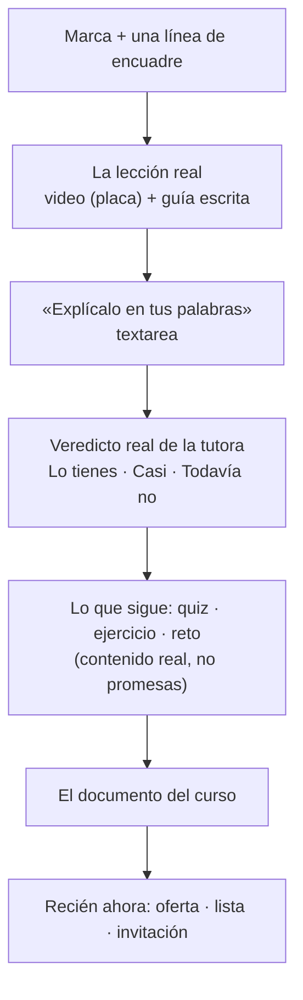

# 11 — The public surface: the landing that runs the lesson

*Written 2026-08-26 alongside the build. The visual system lives in `DESIGN.md`
and the surface strategy in `.impeccable/surfaces/`; this file is the product and
engineering record.*

## Why the landing changed

A stranger cannot try this product — access is invite-gated — and its value is
**verified work, not video**, which is invisible from outside. Every competitor
in the category claims an AI tutor. A visitor cannot tell them apart by reading,
so a claim buys nothing.

The old landing led with a promise, a **mock document**, and three buttons. Two
problems with that shape, both recorded elsewhere in these docs:

1. **The funnel does not leak at the catalog — it leaks inside lesson 1**
   (`docs/06`, UX audit). More top-of-funnel does not touch the actual failure.
2. **The mock was an example nobody had produced.** `docs/06` records the landing
   once showing seeded data as *"documento real de una alumna"*. It was relabelled
   as an example; leading a rebuilt marketing page with a labelled example is the
   same mistake wearing a disclaimer.

> **The page now teaches instead of claiming.** One real lesson, one real answer,
> one real verdict — then the doors.

## The shape



Everything below the verdict is shown with **this lesson's real exercise, this
module's real reto and the real document the course compiles into** — pulled from
the database, not written as marketing copy. Sections that restate a claim in
different words add length, not substance.

## The endpoints

Three, all public by design, all under `/api/learn/public/`.

| Endpoint | Notes |
|---|---|
| `GET /public/demo` | The lesson: title, objectives, key points, written guide, transcript, the explain prompt, plus the module's real exercise, reto and document type |
| `GET /public/demo-poster` | One frame from the lesson, shipped as a static asset |
| `GET /public/demo-video` | The lesson's mp4 |
| `POST /public/demo-explain` | Evaluates one answer, returns a **verdict and never a score** |

### The security rule that shaped all of them

**The lesson id is fixed server-side and can never be supplied by the caller.**

`docs/07` records that `POST /complete` had no access check because "recording a
completion" did not sound like a privileged action — but access is *derived* from
completions, so a write granted a read and one request per `node_id` unlocked all
420 lessons. A public demo endpoint parameterised by `node_id` is that same bug
seen in a mirror: an unauthenticated **read** that accepts an id. It would publish
every gated video in the catalog.

So `DEMO_NODE_ID` is an environment value, the routes take no parameters, and
this is asserted rather than assumed:

| Check | Result |
|---|---|
| `GET /api/learn/video/1` with no session | **401** — the gated path is untouched |
| `GET /api/learn/public/demo-video` | 200, 5.4 MB |
| `…/demo-video?node_id=99` | ignored; the route has no such parameter |

**Abuse controls on the evaluator**, which is an unauthenticated LLM call:
`DEMO_RATE_MAX` 4/hour per IP (the job analyser gets 3/h because a pasted posting
is high intent; this fires on curiosity), the same honeypot field as every other
public text intake, a 40–4000 character bound, and the shared in-flight semaphore.
Verified: the fifth call returns 429 and a filled honeypot returns 400.

The learner's text still goes through `writer._fenced()` with `UNTRUSTED_RULE`,
because it reaches the same evaluator as a paying learner's work.

## `demo_attempts`

What strangers write is kept. **Deliberately not a submission**: no learner owns
it, it earns nothing, it never reaches a portfolio, and it cannot affect anyone's
progress. It exists because `docs/06` records 16 real submissions in total, and
how somebody explains a concept *before* they have any stake in the product is
evidence this project does not otherwise have.

The instrument to watch is not how many strangers answer, but **what fraction get
`todavia_no` on their first try** — that is the closest thing to a read on whether
the lesson actually teaches, measured on people with no reason to be generous.

## Honesty constraints on this surface

`PRODUCT.md` records the absences: no testimonials, no customers, no pricing, no
press, and **no portfolio document compiled from a real learner's work**. None of
these may be invented, implied, or mocked up. The document mock was deleted rather
than restyled; the document now appears as what the course ends in, described
truthfully, rather than as fake proof at the top of the page.

## Two decisions worth keeping

**The video is a plate, not a `<video>` element.** With `preload="metadata"` the
browser buffered the whole 5.4 MB on every visit and then painted the file's own
first frame — a fade from black — over the poster. Both halves of that are wrong
for this audience: `PRODUCT.md` describes people studying on metered mobile data,
and a marketing page is the worst place to spend it. The page now shows a real
frame as an image with the product's own amber play affordance, and creates the
video element only on click. Nobody who does not press play pays for the video.

**The written guide is a masked preview, never a scroll region.** The first
version capped it with `overflow:auto`, and the first scroll gesture over it
scrolled *the guide* to its end — leaving an empty card while the page had not
moved. A nested scroll region mid-page steals the wheel. It is now a fade-masked
preview that expands in place.

## Layout

The app is a 560px phone column at every width, deliberately (`DESIGN.md`, The One
Column Rule): one decision per screen, for a tired person on a phone. That is the
wrong shape for a stranger on a laptop, so `body.wide` — set only by the landing,
cleared by every other route — opens the public surface to 1000px at ≥900px and
splits the lesson two-up.

## Checks

```bash
node studio/dashboard/check_how_section.js          # the landing's promises, 13 assertions
node studio/dashboard/check_cv_render.js studio/dashboard/static/learn.html
```

`check_how_section.js` still guards the "Cómo funciona" block, which survives
below the lesson. There is **no automated check on the demo endpoints yet** — the
manual sequence above (401 on the gated video, 200 on the demo, 429 on the fifth
evaluation, 400 on the honeypot) is what was run, and it is worth turning into a
script before the surface takes real traffic.

## Related

- [01 — Vision](01-vision.md) — why proof beats claims
- [06 — Roadmap](06-roadmap.md) — the funnel leaks inside lesson 1, not at the catalog
- [07 — Engineering notes](07-engineering-notes.md) — the write-that-granted-a-read bug this endpoint is shaped against
- `DESIGN.md` · `.impeccable/surfaces/` — the visual world and the surface brief
