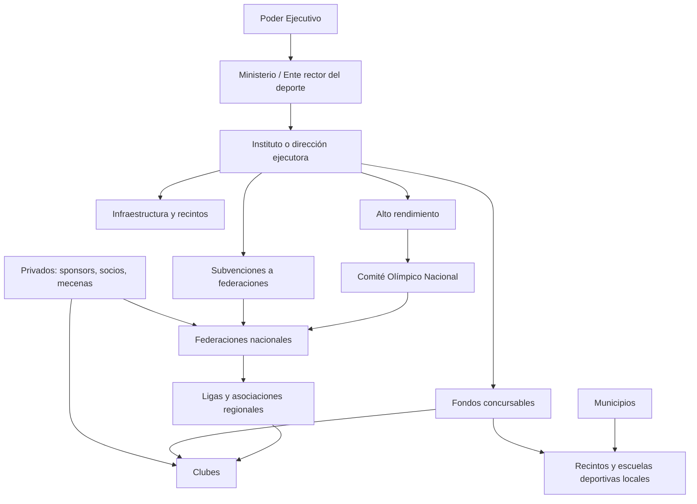
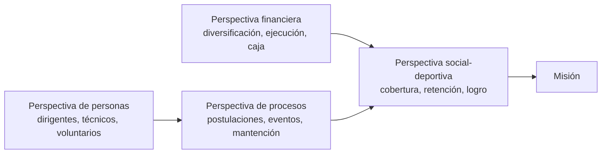
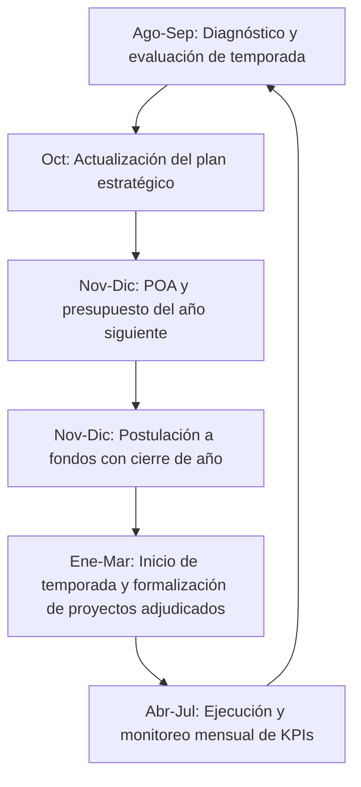
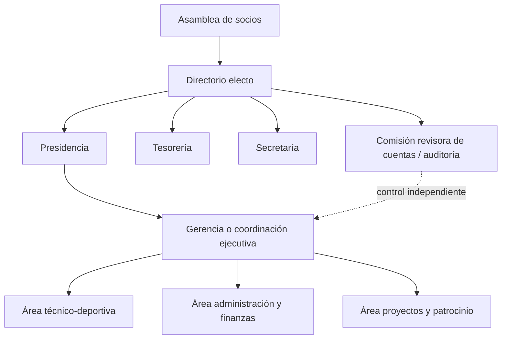
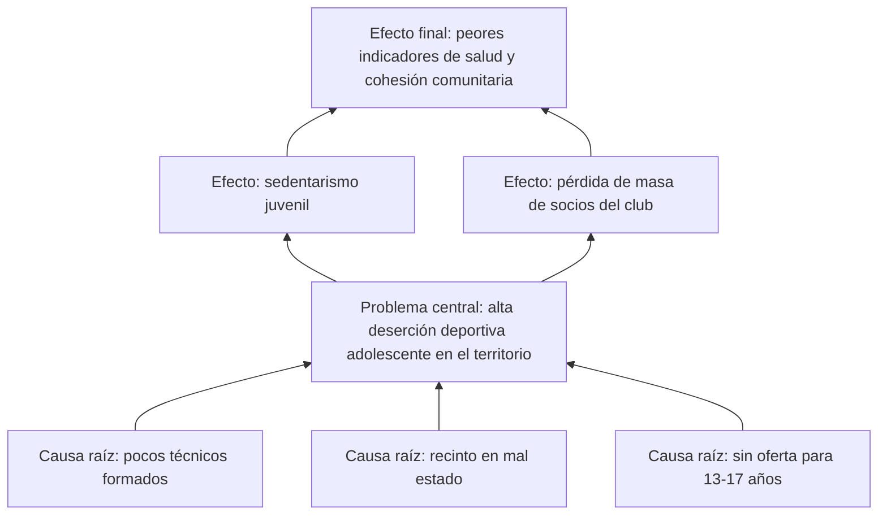
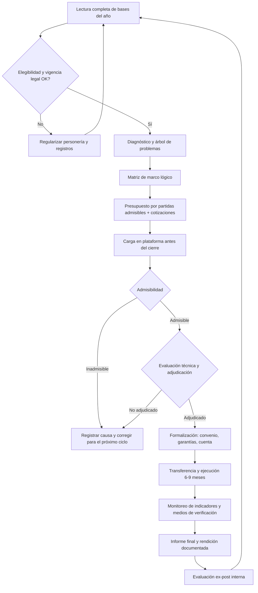
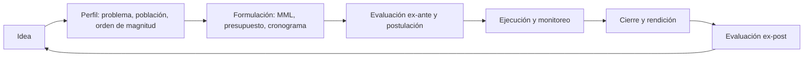
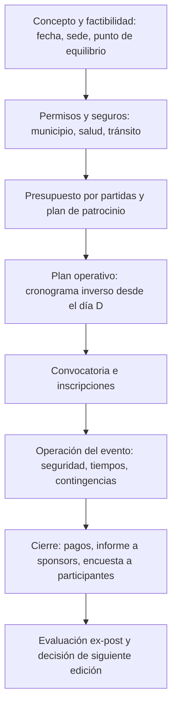

# Gestión Deportiva en América Latina: Documento Fuente del Curso

**Material fuente único y autoritativo para un curso de 30 lecciones (5 bloques × 6 lecciones)**
**Fecha de elaboración: 11 de agosto de 2026**
**Ámbito: América Latina (referencias principales: Chile, Colombia, México, Argentina, Perú, Brasil)**

---

## Convenciones de evidencia

Este documento aplica tres reglas estrictas:

| Marca | Significado |
|---|---|
| **[P]** | Documento oficial: ley, bases de fondo concursable, memoria institucional, reglamento, informe de auditoría o contraloría, presupuesto público, publicación en diario oficial. |
| **[V]** | Estudio de consultora, federación, patrocinador o medio que cita fuentes verificables; se indica quién lo produjo o financió. |
| **[E]** | Estimación estructural del autor: se entrega la **estructura** de partidas y el **orden de magnitud**, no una cifra puntual. El estudiante debe reemplazarla con datos de su propia organización en los ejercicios. |

Toda cifra que circula sin fuente identificable fue **descartada**. Todo dato económico se presenta con moneda, año y fuente. Cuando la única fuente disponible es una declaración de autoridad recogida por prensa, se indica explícitamente ("declaración de X, año").

**Advertencia de vigencia:** los fondos concursables cambian bases, montos y plazos cada año. Las URL listadas apuntan a la institución, no a un PDF de un año específico: el primer hábito profesional que enseña este curso es **leer las bases vigentes, no las del año pasado**.

---

# BLOQUE 1 — El sistema deportivo: actores, niveles y quién financia qué
*(Lecciones 1–6)*

## 1.1 Los tres circuitos del deporte latinoamericano

Todo sistema deportivo nacional en la región opera con tres circuitos que se cruzan pero obedecen a lógicas distintas:

1. **Circuito público-social**: ministerios/institutos del deporte, deporte municipal, deporte escolar. Lógica: cobertura, acceso, salud pública. Se financia con presupuesto público y fondos concursables.
2. **Circuito federado**: comités olímpicos y paralímpicos nacionales, federaciones, ligas, clubes afiliados. Lógica: competencia y representación internacional. Se financia con mezcla de subvención estatal (dominante en casi toda la región), cuotas y patrocinio.
3. **Circuito comercial**: fútbol profesional, gimnasios y wellness, eventos masivos (corridas, ciclismo), marcas y derechos de transmisión. Lógica: rentabilidad. Se financia con venta de entradas, derechos, patrocinio y abonos.

La primera destreza del gestor es ubicar su organización en el mapa: un club amateur vive del circuito público-social y del federado a la vez; un organizador de maratones vive del comercial pero necesita permisos del municipal.

## 1.2 Arquitectura institucional comparada (cinco países)

| País | Ente rector | Naturaleza | Marco legal principal | Fuente |
|---|---|---|---|---|
| Chile | Ministerio del Deporte + Instituto Nacional de Deportes (IND) | Ministerio (política) + servicio público (ejecución) | Ley N° 19.712 del Deporte (2001); Ley N° 20.686 crea el Ministerio (2013) | [P] bcn.cl; ind.cl |
| Colombia | Ministerio del Deporte (ex Coldeportes) | Ministerio; cabeza del Sistema Nacional del Deporte | Ley 181 de 1995; Ley 1967 de 2019 (transformación en ministerio) | [P] mindeporte.gov.co |
| México | Comisión Nacional de Cultura Física y Deporte (CONADE), sectorizada en SEP | Organismo descentralizado | Ley General de Cultura Física y Deporte (2013) | [P] gob.mx/conade |
| Argentina | Secretaría/Subsecretaría de Deportes (rango cambiante según gobierno) + ENARD para alto rendimiento | Secretaría de Estado + ente mixto público-privado | Ley 20.655 del Deporte; Ley 26.573 (ENARD, 2009) | [P] argentina.gob.ar; enard.org.ar |
| Perú | Instituto Peruano del Deporte (IPD), adscrito al Ministerio de Educación | Organismo público ejecutor | Ley N° 28036 de Promoción y Desarrollo del Deporte | [P] gob.pe/ipd |

Lección transversal: **el rango institucional cambia con los gobiernos** (Colombia subió de instituto a ministerio en 2019; Argentina ha oscilado entre ministerio, secretaría y subsecretaría). El gestor no puede asumir estabilidad del interlocutor público: debe seguir la ley y el presupuesto, no el organigrama del momento.

## 1.3 Quién financia qué (mapa de flujos)

- **Estado nacional** → institutos/ministerios → fondos concursables (organizaciones de base), subvenciones directas (federaciones, comités olímpicos), infraestructura mayor, alto rendimiento.
- **Gobiernos regionales/estaduales** → infraestructura media, juegos regionales, institutos estaduales (ej. Brasil: secretarías estaduales administran los estadios del Mundial 2014).
- **Municipios** → operación de recintos locales, escuelas deportivas, talleres, eventos comunales. Es el nivel con más contacto ciudadano y menos capacidad técnica de formulación: ahí trabaja la mayoría de los egresados de este curso.
- **Privados** → patrocinio (visibilidad de marca), mecenazgo con incentivo tributario (Perú: Ley 30479 [P]), derechos de TV (fútbol), cuotas de socios y venta de servicios.
- **Cooperación y organismos** → COI (Solidaridad Olímpica), federaciones internacionales, ONG de deporte para el desarrollo, banca multilateral (infraestructura y evaluación).

Dato de contraste regional documentado: en el debate legislativo argentino de 2025 sobre el re-financiamiento del ENARD se citó que Chile supera los USD 100 millones anuales en alto rendimiento mientras Argentina cerraría 2025 bajo USD 14 millones (declaración parlamentaria recogida por el Comité Olímpico Argentino, nov. 2025, coarg.org.ar) [P/declaración]. La brecha ilustra el punto central del bloque: el financiamiento deportivo es una **decisión política presupuestaria**, no un dato de la naturaleza.

## 1.4 Estructura diagramable: organigrama tipo del sistema nacional

## 1.5 El deporte escolar y el municipal: los eslabones débiles documentados

En Colombia, el anteproyecto de presupuesto del sector recoge que el fondo sectorial debe financiar deporte escolar, investigación e infraestructura territorial [P] (documento de respuestas de Mindeporte a la Cámara de Representantes, 2024, camara.gov.co). En Argentina, el registro parlamentario de 2025 documenta ejecución 0% en el programa de clubes de barrio y 0,02% en escuelas de iniciación deportiva en 2024 sobre un crédito de ARS 280 millones (exposición del diputado G. Martínez en el Congreso, recogida por Tiempo Argentino, ago. 2025) [P/registro parlamentario]. Lección: **un programa presupuestado no es un programa ejecutado**; el gestor debe monitorear ejecución, no solo asignación.

## 1.6 Preguntas guía del bloque

1. ¿Quién es mi contraparte pública real (nacional, regional, municipal) y qué instrumento administra?
2. ¿De qué circuito proviene cada peso de mi organización hoy?
3. ¿Qué porcentaje de mi financiamiento depende de una sola fuente? (Riesgo de concentración: el caso ENARD del Bloque 5 muestra qué pasa cuando esa fuente se corta.)

---

# BLOQUE 2 — Planificación y estrategia
*(Lecciones 7–12)*

## 2.1 Diagnóstico: qué mirar antes de planificar

Un diagnóstico útil para una organización deportiva cubre cinco dimensiones, cada una con evidencia verificable (no impresiones):

| Dimensión | Preguntas | Evidencia mínima |
|---|---|---|
| Legal-institucional | ¿Personalidad jurídica vigente? ¿Directiva al día? ¿Inscripción en registros del ente rector? | Certificados de vigencia; en Colombia, el "reconocimiento deportivo" es requisito legal para participar y recibir recursos [P] (Mindeporte, Dirección de Inspección, Vigilancia y Control, 2026) |
| Deportiva | Nº practicantes, categorías, resultados, retención | Planillas de inscripción, actas de competencia |
| Financiera | Ingresos por fuente, egresos por partida, deudas | Libro de caja / balance simple |
| Infraestructura | Recintos propios/usados, estado, horas de uso | Inventario y calendario de uso |
| Entorno | Demanda local, competidores, aliados, instrumentos públicos disponibles | Datos municipales, bases de fondos vigentes |

La ausencia de vigencia legal es el motivo más frecuente de inadmisibilidad en fondos concursables de la región: el programa colombiano "IVC en el Territorio" existe precisamente para que ligas y clubes tengan su documentación al día [P] (mindeporte.gov.co, 2026).

## 2.2 Del diagnóstico a los objetivos

Regla operativa: un objetivo estratégico deportivo debe poder responder cuatro preguntas: **qué cambia, para quién, cuánto y cuándo**. Formato recomendado (compatible con marco lógico del Bloque 4):

> "Aumentar de 80 a 140 los niños y niñas de 6 a 12 años en escuelas formativas del club, al cierre de la temporada 2027, manteniendo una deserción anual bajo 25%."

Errores típicos que este curso prohíbe: objetivos-actividad ("realizar talleres"), objetivos sin línea base ("aumentar la participación") y objetivos sin plazo.

## 2.3 Planificación estratégica aplicada (organización deportiva pequeña o mediana)

Proceso mínimo viable en 6 pasos, calibrado a organizaciones con dirigencia voluntaria:

1. **Misión en una frase** (a quién sirve, con qué deporte, en qué territorio).
2. **Diagnóstico 5 dimensiones** (2.1).
3. **FODA con evidencia**: cada fortaleza/debilidad debe citar el dato del diagnóstico que la sustenta.
4. **3 a 5 objetivos estratégicos** a 3 años (formato 2.2), cada uno con responsable.
5. **Plan operativo anual (POA)**: actividades, plazos, costos y fuente de financiamiento por objetivo.
6. **Tablero de indicadores** revisado por la directiva con frecuencia fija (mensual o trimestral).

## 2.4 Indicadores de gestión: el set mínimo

| Ámbito | Indicador | Fórmula | Frecuencia |
|---|---|---|---|
| Cobertura | Practicantes activos | Nº inscritos con asistencia ≥60% en el período | Mensual |
| Retención | Tasa de deserción | Bajas del período / inscritos al inicio | Trimestral |
| Finanzas | Dependencia de fuente principal | Ingresos de la mayor fuente / ingresos totales | Trimestral |
| Finanzas | Ejecución presupuestaria | Gasto ejecutado / gasto planificado | Mensual |
| Infraestructura | Ocupación de recinto | Horas usadas / horas disponibles | Mensual |
| Proyectos | Tasa de adjudicación | Proyectos adjudicados / proyectos postulados (últimos 3 años) | Anual |
| Personas | Horas de voluntariado valorizadas | Horas × valor hora de referencia local | Semestral |
| Deportivo | Progresión competitiva | Deportistas que suben de categoría / total elegible | Anual |

Este set replica la lógica con que los propios entes rectores miden: el IND chileno reporta anualmente número de iniciativas financiadas y monto total (500 proyectos y más de CLP 3.167 millones en la convocatoria 2026 [P], ind.cl); una organización postulante debe poder reportarse a sí misma con el mismo rigor.

## 2.5 Cuadro de mando integral adaptado al deporte

Adaptación de las cuatro perspectivas clásicas a una organización deportiva sin fines de lucro:

La perspectiva financiera **no está arriba**: en el deporte social es un medio. Pero es la primera que se revisa en cada sesión de directiva, porque su falla arrastra a las demás.

## 2.6 Estructura diagramable: ciclo anual de planificación

El calendario no es decorativo: en Chile, las bases de Fondeporte 2026 se publicaron el 19 de noviembre de 2025 y la postulación corrió del 29 de noviembre al 19 de diciembre de 2025 [P] (IND, proyectosdeportivos.cl). **Tres semanas de ventana.** Una organización sin diagnóstico y presupuesto listos en octubre no alcanza a formular en diciembre; llega a improvisar.

---

# BLOQUE 3 — Administración y gobernanza
*(Lecciones 13–18)*

## 3.1 Presupuesto: principios operativos

1. **Por partidas, no por totales**: todo presupuesto de este curso se desagrega en recursos humanos, operación, equipamiento, difusión, administración e imprevistos.
2. **Devengado vs. caja**: comprometido no es pagado. Los fondos públicos rinden contra gasto efectivo y documentado.
3. **Cofinanciamiento**: casi todos los instrumentos de la región financian "total o parcialmente" (fórmula literal de las bases de Fondeporte [P], REX N° 2756/2023, ind.cl); la organización debe demostrar aporte propio, monetario o valorizado.
4. **Restricciones de gasto**: cada fondo define qué partidas admite (Fondeporte, por ejemplo, autoriza gasto en personal según parámetros de sus bases [P]). Presupuestar una partida inadmisible invalida el proyecto.

## 3.2 Estructura de costos real N°1: club amateur (multideporte o uninominal, 100–300 socios)

Estructura de partidas [E] con anclas verificables donde existen. Los porcentajes son estructurales; el monto total anual de un club amateur urbano en la región se mueve típicamente entre el equivalente a USD 10.000 y USD 60.000 según tenga o no recinto propio [E].

| Partida | % típico del gasto anual | Contenido | Observación verificable |
|---|---|---|---|
| Recursos humanos técnicos | 30–45% | Monitores, entrenadores por hora | En clubes de barrio suele ser el único gasto profesionalizado |
| Arriendo/uso de recinto | 10–25% | Canchas municipales o privadas por hora | Si el recinto es municipal cedido, pasa a aporte valorizado |
| Equipamiento y materiales | 10–15% | Balones, mallas, implementos, uniformes | Partida financiable en la mayoría de fondos concursables [P] |
| Competencia | 10–20% | Inscripciones a ligas, traslados, arbitrajes | Los aranceles federativos son públicos en cada federación |
| Administración | 5–10% | Contabilidad, certificados, plataforma, seguros | La vigencia legal cuesta dinero y se presupuesta |
| Eventos y difusión | 5–10% | Aniversario, campeonato propio, redes | Suele ser la partida que capta patrocinio local |
| Imprevistos | 5% | — | Regla mínima de prudencia |

Ancla de escala pública: el proyecto máximo financiable en la categoría investigación de Fondeporte 2026 fue de CLP 7.800.000 (≈ USD 8.100 a tipo de cambio de fines de 2025) [P] (bases 2026 difundidas por instituciones postulantes, investigacion.uss.cl); los proyectos deportivos de base adjudicados promedian bajo ese orden: CLP 3.167 millones repartidos entre 500 iniciativas dan un promedio de ≈ CLP 6,3 millones (≈ USD 6.500) por proyecto en 2026 [P] (ind.cl). Es decir: **un fondo concursable típico financia una o dos partidas del club por un año, no el club completo**.

## 3.3 Estructura de costos real N°2: evento deportivo mediano (corrida, campeonato regional, 500–3.000 participantes)

Estructura [E] validable contra presupuestos de producción de eventos:

| Partida | % típico | Contenido |
|---|---|---|
| Producción técnica | 25–35% | Cronometraje, vallas, sonido, escenario, generadores |
| Seguridad, salud y permisos | 15–20% | Ambulancias, paramédicos, seguros, cierre de calles, permisos municipales |
| Personal y voluntariado | 10–15% | Coordinación remunerada + logística de voluntarios (alimentación, credenciales, poleras) |
| Kit del participante y premiación | 15–20% | Número, medalla, hidratación, premios |
| Difusión y marketing | 10–15% | Piezas, pauta, fotografía |
| Administración y contingencias | 10% | Plataforma de inscripción (que además cobra comisión por transacción), imprevistos |

Reglas duras del rubro: (a) los costos de seguridad y salud **no se recortan**: son la condición del permiso municipal; (b) el punto de equilibrio se calcula con inscripciones pesimistas (70% de la meta), porque la inscripción de última semana es volátil; (c) el patrocinio se valoriza y se contrata **antes** de fijar el precio de inscripción, no después.

## 3.4 Estructura de costos real N°3: instalación deportiva municipal (polideportivo o estadio pequeño)

| Partida | % típico del gasto operativo anual [E] | Ancla documentada |
|---|---|---|
| Personal (administración, mantención, seguridad) | 40–55% | En recintos públicos el personal domina el gasto corriente |
| Servicios básicos (electricidad, agua, gas) | 15–25% | Iluminación y climatización son los conductores; en la Arena da Amazônia el sistema de refrigeración por sí solo consume contratos por R$ 1,2 millones anuales (≈ USD 220.000, 2026) [V] (Gazeta do Povo, jun. 2026, citando a la secretaría estadual Sedel) |
| Mantención de superficies y equipos | 15–20% | Césped/pisos deportivos concentran esta partida; en Manaos, césped e iluminación explican el grueso de los ≈ R$ 700 mil mensuales reportados en 2019 [P/declaración] (secretaría Sejel-AM, recogido por prensa deportiva) |
| Aseo e insumos | 5–10% | — |
| Reposición menor e imprevistos | 5–10% | — |

Ancla mayor documentada: la Arena da Amazônia (44.000 asientos) reportó costos de manutención de entre R$ 700 mil y R$ 1 millón mensuales entre 2016 y 2021 según su administración estadual (≈ USD 180.000–260.000 mensuales a tipos de cambio de esos años) [P/declaraciones oficiales recogidas por prensa]. Regla derivada para el gestor municipal: **el costo de operar un recinto durante 20–30 años supera al costo de construirlo**; toda decisión de infraestructura se evalúa en ciclo de vida, no en inauguración.

## 3.5 Recursos humanos y voluntariado

- **Dirigencia voluntaria con responsabilidad legal**: en toda la región, los directores de corporaciones y clubes responden por la rendición de fondos públicos. La capacitación dirigencial es gestión de riesgo, no un beneficio.
- **Valorización del voluntariado**: horas × valor de referencia (por ejemplo, el valor hora de un monitor local). Sirve como aporte propio en cofinanciamiento cuando las bases lo admiten — verificar en cada base [P].
- **Profesionalización gradual**: la secuencia realista es contador externo → coordinador a honorarios → gerente. Saltarse etapas quiebra la caja; no avanzar nunca quiebra la continuidad (todo depende de una persona).
- **Técnicos certificados**: las federaciones y los fondos exigen crecientemente certificación de entrenadores; presupuestarla.

## 3.6 Gestión de instalaciones

Modelo operativo mínimo: inventario → calendario de uso con tarifario diferenciado (comunidad / clubes / privados) → plan de mantención preventiva (diaria, mensual, anual) → registro de ocupación (KPI 2.4). El error regional típico y documentado es la infraestructura sin modelo de operación: los estadios del Mundial 2014 sin club ancla resultaron inviables de concesionar y quedaron cargados a los gobiernos estaduales [V] (Gazeta do Povo, 2026; alertas previas del TCU y del TCE-AM desde 2010 [P]).

## 3.7 Compliance e integridad (post-reformas FIFA 2016 y Agenda Olímpica 2020 del COI)

Las reformas de gobernanza de FIFA (2016, tras el caso de corrupción de 2015) y del COI (Agenda Olímpica 2020 y 2020+5) bajaron a las federaciones nacionales exigencias hoy estándar:

1. **Separación de poderes**: directiva electa ≠ gerencia ejecutiva ≠ comisión de auditoría/ética independiente.
2. **Límites de mandato** y elecciones supervisadas.
3. **Control financiero externo**: estados auditados; FIFA audita centralizadamente el uso de sus fondos de desarrollo (programa Forward) y publica reglamentos de uso [P] (fifa.com, FIFA Forward Programme Regulations).
4. **Integridad deportiva**: prevención de amaño de partidos, protección de menores (safeguarding), antidopaje (los Estados también invierten aquí: Colombia proyectó pasar de 2.500 a ≈ 5.000 muestras anuales de control al dopaje en 2025 [P], respuestas de Mindeporte a la Cámara, 2024).
5. **Inspección estatal**: en Colombia la Dirección de Inspección, Vigilancia y Control del Ministerio del Deporte fiscaliza a ligas y clubes; sin reconocimiento deportivo vigente no hay participación ni recursos [P] (mindeporte.gov.co, 2026).

## 3.8 Transparencia y rendición de cuentas

Estándar mínimo enseñable: (a) memoria anual pública con estados financieros; (b) rendición de cada fondo público en el formato exigido por sus bases, con respaldo documental completo; (c) actas de directorio; (d) publicación de adjudicaciones y compras relevantes. Referencia práctica: la fase posterior a la adjudicación en Fondeporte es una **etapa formal de "formalización"** con requisitos propios [P] (ind.cl, 2026) — adjudicar no es cobrar; muchas organizaciones pierden proyectos adjudicados por fallar aquí.

## 3.9 Estructura diagramable: gobernanza tipo de una organización deportiva

---

# BLOQUE 4 — Formulación de proyectos (corazón práctico del curso)
*(Lecciones 19–24)*

## 4.1 Por qué marco lógico

La Metodología de Marco Lógico (MML) es el estándar de formulación en los sistemas de inversión y fondos públicos de la región (difundida por CEPAL/ILPES en su Serie Manuales N° 42, "Metodología del marco lógico para la planificación, el seguimiento y la evaluación de proyectos y programas", 2005 [P] cepal.org). Los formularios de fondos deportivos piden sus componentes aunque no usen el nombre: problema, objetivos, actividades, presupuesto, indicadores, verificación.

## 4.2 Árbol de problemas

Reglas: el problema central es una **situación negativa existente** (no "falta de X", que presupone la solución); las causas van abajo, los efectos arriba; cada rama debe ser verificable con el diagnóstico del Bloque 2.

El **árbol de objetivos** se obtiene espejando cada enunciado en positivo; las ramas de causas se convierten en los componentes del proyecto.

## 4.3 Matriz de marco lógico (plantilla operativa)

| Nivel | Resumen narrativo | Indicadores verificables | Medios de verificación | Supuestos |
|---|---|---|---|---|
| **Fin** | Contribución de largo plazo (ej.: mejorar la salud y cohesión juvenil del territorio) | Indicador de contexto (encuestas, datos municipales) | Estadísticas públicas | Estabilidad de políticas locales |
| **Propósito** | El cambio que el proyecto logra en su población (ej.: adolescentes del sector mantienen práctica deportiva regular) | ≥100 adolescentes con asistencia ≥60% al mes 9 | Registros de asistencia firmados | Las familias sostienen la participación |
| **Componente 1** | Talleres deportivos implementados | 3 talleres semanales operando desde el mes 2 | Planificaciones y actas | Disponibilidad del recinto |
| **Componente 2** | Técnicos capacitados | 4 monitores certificados al mes 4 | Certificados | Oferta de certificación disponible |
| **Actividades** | Listado por componente con costo | Presupuesto por partidas (4.4) | Facturas, boletas, contratos | Transferencia oportuna del fondo |

Regla de oro de coherencia vertical: si todas las actividades se ejecutan, se producen los componentes; si los componentes se producen **y los supuestos se cumplen**, se logra el propósito. Un supuesto que probablemente no se cumpla ("el municipio cederá gratis el recinto todo el año") es un supuesto fatal: se rediseña el proyecto, no se anota y se reza.

## 4.4 Presupuesto por partidas (plantilla)

| Partida | Detalle | Unidad | Cantidad | Costo unitario | Total | Fuente (fondo / aporte propio / valorizado) |
|---|---|---|---|---|---|---|
| RRHH | Monitor de taller | hora | 288 | — | — | Fondo |
| Equipamiento | Balones N°5 | unidad | 30 | — | — | Fondo |
| Operación | Arriendo gimnasio | hora | 144 | — | — | Valorizado (cesión municipal) |
| Difusión | Pendones y redes | global | 1 | — | — | Aporte propio |
| Administración | Contabilidad y rendición | mes | 9 | — | — | Aporte propio |

Exigencias transversales de fondos públicos [P]: cotizaciones de respaldo, topes por partida definidos en bases, gasto dentro del período de ejecución (Fondeporte 2026: proyectos de 6 a 9 meses [P]), y rendición documentada.

## 4.5 Cronograma

Carta Gantt simple por actividad y mes, con tres hitos obligatorios: **inicio formal** (convenio firmado y transferencia recibida — no antes), **corte de medio término** (verificación de indicadores de componentes) y **cierre** (informe final + rendición). El plazo del cronograma se subordina a las bases, no al deseo.

## 4.6 Indicadores verificables y medios de verificación

Un indicador de proyecto se redacta con la fórmula **CCT**: Cantidad + Calidad + Tiempo ("100 adolescentes [C] con asistencia ≥60% [C] al mes 9 [T]"). El medio de verificación debe ser un documento que un revisor externo pueda auditar: lista de asistencia firmada, certificado, fotografía fechada, acta. Si el medio de verificación no existirá naturalmente, se diseña su producción como actividad (con costo).

## 4.7 Evaluación ex-ante y ex-post

- **Ex-ante** (antes de postular): pertinencia (¿ataca la causa raíz?), coherencia vertical de la MML, viabilidad de supuestos, costo por beneficiario comparado con proyectos similares adjudicados (dato público en resoluciones de adjudicación [P]).
- **Ex-post** (al cierre): eficacia (indicadores logrados vs. comprometidos), eficiencia (costo real por beneficiario), sostenibilidad (¿qué sigue funcionando sin el fondo?) y aprendizajes registrados por escrito para la siguiente postulación. La evaluación ex-post honesta de un proyecto propio vale más que diez diplomados: es el insumo directo de la tasa de adjudicación futura (KPI 2.4).

## 4.8 Instrumentos de financiamiento público vigentes (cinco países)

**Verificado a agosto de 2026. Las bases cambian cada año: confirmar siempre en la URL institucional.**

| País / Instrumento | Quién postula | Montos y datos duros documentados | Plazos típicos | Qué exige la postulación | URL |
|---|---|---|---|---|---|
| **Chile — FONDEPORTE** (Fondo Nacional para el Fomento del Deporte, IND; Ley 19.712, Reglamento DS 19/2017 mod. DS 17/2021 [P]) | Organizaciones deportivas, municipios, servicios públicos, fundaciones/corporaciones, org. comunitarias; personas naturales con posgrado solo en categoría ciencias [P] | Convocatoria 2026: 500 proyectos adjudicados por más de CLP 3.167 millones (≈ USD 3,3 millones, 2026) [P]; convocatoria 2025: 2.454 postulaciones y más de CLP 2.936 millones adjudicados [P/IND]; tope categoría ciencias 2026: CLP 7,8 millones por proyecto [P] | Bases en noviembre; postulación fines de noviembre a mediados de diciembre (2026: 29-nov al 19-dic-2025); ejecución 6–9 meses [P] | Vigencia legal, formulación en línea (proyectosdeportivos.cl), presupuesto por partidas admisibles, cofinanciamiento cuando aplica, rendición posterior | ind.cl · chileatiende.gob.cl/fichas/1639 · proyectosdeportivos.cl |
| **Colombia — Convocatorias del Ministerio del Deporte** (Ley 181/1995; convocatoria de proyectos de federaciones; Convocatoria de Iniciativas Comunales para escenarios recreo-deportivos, Ley 2166/2022 [P]) | Federaciones deportivas nacionales (proyectos anuales); organismos de acción comunal (iniciativas de infraestructura, 400 cupos en la convocatoria I [P]) | Apoyo al alto rendimiento 2026: COP 63.500 millones (≈ USD 15,5 millones, 2026) a comités olímpico/paralímpico y federaciones [P/Mindeporte]; contexto: fuerte recorte del presupuesto sectorial 2026 denunciado en el Congreso (COP 198 mil millones en el anteproyecto) [P/declaración parlamentaria, 2025] | Federaciones: presentación de proyectos hasta mediados de noviembre para la vigencia siguiente [V/Ámbito Jurídico, citando a Mindeporte]; comunales: hasta agotar cupos | Reconocimiento deportivo y representación legal vigentes (fiscalizados por IVC [P]); proyecto con presupuesto; para comunales, foco en mejoramiento de escenarios | mindeporte.gov.co |
| **México — Programa de Cultura Física y Deporte (CONADE)**, Reglas de Operación publicadas en el DOF (feb. 2025 [P]) | Asociaciones Deportivas Nacionales, órganos estatales de cultura física, deportistas y entrenadores (vía la asociación u órgano correspondiente) | ROP 2025: premio por medalla olímpica MXN 3 / 2 / 1 millones (oro/plata/bronce), extendido a entrenadores [P/DOF, vía Proceso]; becas: MXN 243,7 millones otorgados a 2.229 deportistas y 363 entrenadores entre oct-2024 y jun-2025 [P/Informe de Gobierno]; incremento de 25% en becas y estímulos en las ROP 2025 [P] | Las ROP se publican al inicio del ejercicio fiscal (2025: vigentes desde el 12 de febrero) [P]; trámites con formatos oficiales (ej. CONADE-2023-024-001, apoyos de alto rendimiento [P/DOF]) | Convenio de concertación/coordinación con CONADE tras resolución favorable [P]; requisitos por trámite en el DOF; comprobación del gasto | gob.mx/conade · dof.gob.mx |
| **Argentina — ENARD (Ley 26.573) + Programa Clubes Argentinos (Secretaría de Deportes)** | ENARD: deportistas y entrenadores de alto rendimiento vía sistema de becas por nivel de logro [P/enard.org.ar]; Clubes Argentinos: clubes de barrio y pueblo para infraestructura [P/clubesargentinos.deportes.gob.ar] | Advertencia documentada: el art. 39 de la Ley 26.573 (cargo del 1% a telefonía móvil) fue derogado en 2017 y el ENARD perdió autarquía financiera [P/fundamentos de dictamen legislativo, 2025]; presupuesto 2026: 978 becas previstas vs. 1.189 becados en julio 2024 [P/proyecto de presupuesto, vía prensa]; ejecución 2025 del programa de clubes de barrio: 0% según registro parlamentario [P/declaración, ago. 2025] | Becas ENARD: por ciclo olímpico/panamericano según sistema publicado [P]; Clubes Argentinos: convocatorias intermitentes — verificar apertura real, no solo existencia del sitio | ENARD: logros deportivos acreditados y aval federativo; Clubes: personería, proyecto de obra, presupuesto | enard.org.ar · clubesargentinos.deportes.gob.ar |
| **Perú — Subvenciones IPD a federaciones + Ley de Mecenazgo Deportivo (Ley 30479, reglamento 2017 [P])** | Subvenciones: federaciones deportivas nacionales (directivas DINADAF, ej. Directiva 003-2025 [P]); Mecenazgo: federaciones, deportistas calificados, entrenadores, deportistas con discapacidad, registrados como beneficiarios | Mecenazgo: deducción del gasto en Impuesto a la Renta y exoneración de IGV a importaciones destinadas a las actividades cubiertas [P/SUNAT, gob.pe]; actividades financiables: infraestructura, programas de gestión, subvención a deportistas y entrenadores, investigación y medicina deportiva, viajes [P] | Subvenciones: ciclo presupuestal anual del IPD; Mecenazgo: registro permanente del beneficiario en el sistema del IPD [P/gob.pe] | Registro vigente en RENADE; para mecenazgo, calificación del beneficiario y, en su caso, condición de entidad perceptora de donaciones ante SUNAT [P] | gob.pe/ipd · ipd.gob.pe/mecenazgo-deportivo |

Lectura crítica obligatoria de la tabla: los instrumentos **existen en la ley pero fluctúan en la caja** (Argentina 2024–2026 y el recorte colombiano 2026 son la prueba documentada). El gestor formula para el instrumento vigente y diversifica fuentes; nunca construye una organización sobre un solo fondo.

## 4.9 Estructura diagramable: flujo de postulación a un fondo concursable

## 4.10 Estructura diagramable: ciclo de vida del proyecto

---

# BLOQUE 5 — Aplicación sectorial y casos reales
*(Lecciones 25–30)*

## 5.1 Modelos de negocio en el deporte privado

Cuatro modelos dominantes en la región, con su ecuación económica:

| Modelo | Ingreso principal | Riesgo central | Ejemplo regional |
|---|---|---|---|
| Club sociodeportivo por cuotas | Cuotas de socios + arriendo de instalaciones | Morosidad y fuga de socios | Clubes tradicionales de Argentina y Uruguay (modelo asociativo civil) |
| Academia / escuela deportiva | Mensualidades por servicio formativo | Estacionalidad y rotación de técnicos | Academias de fútbol, tenis y artes marciales en toda la región |
| Fútbol profesional | Derechos de TV + traspasos + patrocinio + estadio | Dependencia de resultados deportivos; en clubes formadores, dependencia de venta de jugadores | Ligas nacionales; el mecanismo de solidaridad FIFA paga a clubes formadores un porcentaje de cada transferencia internacional (Reglamento sobre el Estatuto y la Transferencia de Jugadores, FIFA [P]) |
| Eventos participativos | Inscripciones + patrocinio | Clima, permisos y volatilidad de inscripción (3.3) | Corridas masivas y cicloeventos urbanos |

Principio transversal: en cualquier modelo, la pregunta de diseño es **quién paga, por qué valor percibido y con qué recurrencia**. Un modelo sin recurrencia (todo depende de un evento anual) es estructuralmente frágil.

## 5.2 Patrocinio y su valorización

El patrocinio no es una donación: es una compra de activos de marketing. La propuesta se construye en cuatro pasos:

1. **Inventario de activos**: presencia de marca (camiseta, recinto, piezas digitales), contenido (historias de deportistas), activación (presencia en eventos, clínicas con la marca), datos (audiencia, base de inscritos con consentimiento), hospitality.
2. **Valorización activo por activo**: cada activo se valoriza contra su alternativa de mercado — costo de alcanzar la misma audiencia por pauta local, tarifas de arriendo de espacios equivalentes, valor de mercado de entradas o experiencias. La suma, con un descuento de paquete (10–20%), da el precio de lista [E].
3. **Alineación**: se ofrece a marcas cuyo cliente coincide con la comunidad del club; se documenta la coincidencia (perfil de socios, datos de asistencia).
4. **Contrato y reporte**: entregables, exclusividad por categoría, plazo, y un **informe de cumplimiento** al cierre (fotos, métricas). El informe es lo que renueva contratos.

Marco tributario documentado que cambia la conversación con el privado: en Perú, la Ley 30479 de Mecenazgo Deportivo permite al aportante deducir el gasto en Impuesto a la Renta y distingue "mecenas" (dona sin difusión) de "patrocinador" (aporta con derecho a difundir su condición) [P] (SUNAT, gob.pe). Donde exista incentivo tributario, la propuesta debe explicarlo con el artículo en la mano.

## 5.3 Gestión de eventos: ciclo y decisiones críticas

Decisiones críticas con evidencia regional: (a) **la sede define el costo**: eventos en recintos sobredimensionados heredan costos de operación desproporcionados (3.4); (b) **el punto de no retorno** (fecha límite de cancelación sin quiebra) se fija por contrato con proveedores; (c) los megaeventos enseñan en escala lo que aplica en miniatura — Lima 2019 usó contratos NEC opción F priorizando plazos, con supervisión de la Contraloría General de la República [P] (El Peruano, 2019): estándar transferible, en espíritu, a cualquier evento con fecha inamovible.

## 5.4 Deporte para el desarrollo social

Programas que usan el deporte como vehículo de resultados sociales (convivencia, permanencia escolar, salud). Reglas de diseño serias: definir el resultado social como propósito de la MML (no "hacer deporte"), medirlo con indicadores propios (no solo asistencia) y presupuestar la medición. Referente regional documentado de intervención sostenida: la Ciclovía Recreativa de Bogotá, operada por el Instituto Distrital de Recreación y Deporte (IDRD) desde los años setenta, que abre corredores viales dominicales a la actividad física y ha sido replicada en decenas de ciudades de la región; su operación, kilómetros y asistencia se reportan en los documentos institucionales del IDRD [P] (idrd.gov.co). Su lección de gestión: **recurrencia semanal + bajo costo por usuario + alianza estable con la autoridad de tránsito** vale más que cualquier evento espectacular único.

## 5.5 SEIS CASOS REALES

### Éxito 1 — Juegos Panamericanos y Parapanamericanos Lima 2019 (Perú)

- **Qué se decidió**: ante retrasos críticos, el Estado peruano adoptó un acuerdo gobierno-a-gobierno con el Reino Unido para la gestión del proyecto y contratos NEC opción F que priorizan el cumplimiento de plazos, con acceso pleno de la Contraloría a la fiscalización [P] (El Peruano, jul. 2019).
- **Qué resultó**: todas las sedes y la Villa Panamericana (1.096 departamentos) se entregaron a tiempo [P]; la inversión total reportada fue de ≈ S/ 4.000 millones con IGV (≈ USD 1.200 millones, 2019), bajo el plan maestro aprobado [P/declaraciones oficiales del Comité Organizador recogidas por El Peruano y Andina, 2019]; la dirección ejecutiva reportó posteriormente una ejecución cercana a S/ 3.800 millones contra un plan maestro de S/ 5.000 millones más IGV [V/columna del exdirector en El Comercio, 2024 — cifra de parte interesada, contrastar con informes de la Contraloría].
- **Qué se aprende**: (1) importar capacidad de gestión de proyectos es legítimo y a veces decisivo; (2) el modelo contractual es una decisión estratégica, no un trámite; (3) la fiscalización concurrente (Contraloría dentro del proyecto, no después) previno el patrón regional de sobrecostos. El desafío pendiente y monitoreable es el uso posterior de las sedes (Proyecto Legado [P], gob.pe/legado) — un éxito de entrega no garantiza un éxito de legado.

### Éxito 2 — INDER Medellín: sistema municipal de deporte y recreación (Colombia)

- **Qué se decidió**: Medellín consolidó un instituto municipal descentralizado (INDER, creado en 1993) con presupuesto propio, a cargo de escenarios, escuelas populares del deporte y recreación comunitaria, integrado a la política social de la ciudad [P] (inder.gov.co, memorias y planes de acción institucionales).
- **Qué resultó**: continuidad de programas por más de tres décadas a través de administraciones de distinto signo, con oferta territorializada en comunas y corregimientos, y reportes públicos anuales de gestión [P] (planes de acción e informes de gestión, inder.gov.co). El caso es citado como referente de institucionalidad deportiva municipal en la región.
- **Qué se aprende**: (1) la forma jurídica importa: un instituto descentralizado con presupuesto propio sobrevive a los ciclos políticos mejor que una "oficina de deportes"; (2) el deporte municipal gana escala cuando se integra a la política social (seguridad, convivencia, salud) en lugar de competir con ella por recursos; (3) la rendición pública anual construye la legitimidad que protege el presupuesto.

### Éxito 3 — Ciclovía Recreativa de Bogotá / IDRD (Colombia)

- **Qué se decidió**: sostener durante décadas un programa dominical de cierre de vías para actividad física, operado por el IDRD con personal propio, guardianes de ciclovía y coordinación con tránsito [P] (idrd.gov.co).
- **Qué resultó**: un programa de acceso masivo y gratuito, de costo por usuario bajo en relación con cualquier infraestructura equivalente, replicado en múltiples ciudades de América Latina; la literatura de salud pública lo documenta como intervención poblacional de actividad física (estudios académicos sobre ciclovías recreativas en la región [V], financiados principalmente por universidades y agencias de salud).
- **Qué se aprende**: (1) programas recurrentes y simples superan en impacto acumulado a eventos complejos; (2) la alianza interinstitucional (deporte + tránsito + policía) es el activo crítico, y se gestiona como tal; (3) un programa con identidad ciudadana fuerte se vuelve políticamente costoso de eliminar: esa es una forma real de sostenibilidad.

### Fracaso 1 — Arena da Amazônia, Manaos (Brasil, Copa 2014)

- **Qué se decidió**: construir un estadio de 44.000 asientos para cuatro partidos del Mundial en una ciudad sin clubes de primera división, pese a alertas del Tribunal de Contas da União (TCU) y del tribunal de cuentas estadual sobre inconsistencias presupuestarias desde 2010 [P/V] (alertas del TCU y TCE-AM recogidas por Gazeta do Povo, 2026).
- **Qué resultó**: costo final de R$ 757,5 millones, 51% sobre el presupuesto inicial de R$ 499,5 millones [V] (Gazeta do Povo, jun. 2026, sobre datos oficiales; el balance del Ministerio del Deporte de dic. 2014 reportó R$ 660,5 millones [P], la diferencia refleja aditivos posteriores); mantención estadual de entre R$ 700 mil y R$ 1 millón mensuales durante años (≈ USD 180.000–260.000/mes) [P/declaraciones de las secretarías Sejel-AM y de la administración estadual, 2016–2021]; investigaciones de la operación Lava Jato sobre la obra [V/prensa].
- **Qué se aprende**: (1) la demanda posterior al evento se evalúa **antes** de construir: sin club ancla ni calendario, no hay modelo de operación; (2) las alertas de los órganos de control son información gratuita de altísimo valor — ignorarlas fue una decisión, no un accidente; (3) el costo de ciclo de vida (30 años de mantención) debió estar en la evaluación ex-ante.

### Fracaso 2 — El programa de estadios del Mundial 2014 en su conjunto (Brasil)

- **Qué se decidió**: financiar 12 estadios mayoritariamente con recursos y crédito públicos, con participación privada de solo 7,2% del total [V] (compilación de Mises Brasil, 2026, sobre balances oficiales y datos del TCU).
- **Qué resultó**: costo total de R$ 8.400 millones de la época (≈ R$ 14.200 millones ajustados por inflación a 2026) [V]; el estadio Mané Garrincha de Brasilia costó cerca de R$ 2.000 millones, alrededor del triple del presupuesto original, y fue clasificado por el TCU como elefante blanco tras la Copa [P/TCU, vía compilaciones de prensa]; los estadios sin club de elite resultaron inviables de concesionar y sus costos quedaron en los gobiernos estaduales [V] (Gazeta do Povo, 2026).
- **Qué se aprende**: (1) el fracaso no fue de un estadio sino del **portafolio**: la decisión de 12 sedes fue política, no técnica; (2) cuando el privado no arriesga capital, sus incentivos para dimensionar bien desaparecen; (3) para el gestor local: un compromiso internacional (FIFA, COI, Panam Sports) no sustituye la evaluación ex-ante nacional — la agrava, porque fija plazos y estándares que encarecen todo.

### Fracaso 3 — Desfinanciamiento del ENARD (Argentina, 2017–2026)

- **Qué se decidió**: la Ley 26.573 (2009) creó el ENARD con financiamiento propio por un cargo del 1% sobre la telefonía móvil (art. 39); la reforma tributaria de 2017 derogó esa fuente y el ente pasó a depender de partidas presupuestarias [P] (fundamentos del dictamen legislativo de 2025 que busca restituir el art. 39, recogidos por medios parlamentarios y por el Comité Olímpico Argentino).
- **Qué resultó**: pérdida de autarquía financiera, becas y preparación internacional afectadas [P/fundamentos del dictamen]; presupuesto congelado en términos reales según fuentes internas del ente citadas por prensa en 2025 [V]; reducción de becados (1.189 en julio de 2024 contra 978 previstas en el presupuesto 2026 [P/proyecto de presupuesto, vía prensa]); en 2025 el Congreso dictaminó con amplio consenso restituir una fuente específica [P/dictamen de comisiones, nov. 2025].
- **Qué se aprende**: (1) un fondo con afectación específica (impuesto marcado) protege al deporte del ciclo fiscal, y su eliminación tiene efectos medibles en menos de un ciclo olímpico; (2) para las organizaciones aguas abajo (federaciones, deportistas), la concentración de fuentes en un solo ente estatal es un riesgo estructural que debe gestionarse con diversificación; (3) las políticas se defienden con datos: la comparación documentada Chile/Argentina (1.3) fue el argumento central del dictamen.

## 5.6 Plantilla: propuesta de patrocinio (índice tipo, 8–12 páginas)

1. La organización en una página (misión, comunidad, datos duros).
2. Audiencia: perfil y tamaño (socios, asistentes, seguidores; con fuente interna).
3. Activos ofrecidos e inventario valorizado (5.2).
4. Paquetes (3 niveles) con precio y entregables por nivel.
5. Beneficio tributario aplicable, con norma citada (donde exista, ej. Ley 30479 [P]).
6. Casos de colaboraciones previas y testimonios.
7. Condiciones: exclusividad por categoría, plazo, forma de pago.
8. Compromiso de reporte de cumplimiento al cierre.

## 5.7 Plantilla: plan operativo anual (POA)

| Objetivo estratégico | Actividad | Responsable | Mes inicio | Mes fin | Costo | Fuente de financiamiento | Indicador de cumplimiento |
|---|---|---|---|---|---|---|---|
| (del plan estratégico) | (concreta y verificable) | (persona, no "el club") | — | — | — | (propia / fondo X / sponsor) | (CCT, ver 4.6) |

## 5.8 Plantilla: set de KPIs de gestión

Usar los 8 indicadores de la tabla 2.4, cada uno con: línea base, meta anual, frecuencia, responsable de medición y fuente del dato. Sin línea base no hay KPI: hay deseo.

---

# SEMILLAS DE EJERCICIO (15 tareas encadenadas, 10–20 minutos cada una)

El estudiante elige **una organización deportiva real** (su club, su municipio, una federación que conozca) y la mantiene durante todo el curso. Cada tarea produce un artefacto que alimenta la siguiente. Al final tiene un proyecto formulado completo y postulable.

| # | Bloque | Tarea | Artefacto producido |
|---|---|---|---|
| 1 | 1 | Ubicar la organización en el mapa del sistema: circuito(s), nivel, contrapartes públicas reales con nombre de institución | Ficha de posicionamiento (1 página) |
| 2 | 1 | Identificar los 3 instrumentos de financiamiento a los que la organización podría postular hoy, con URL de bases vigentes | Tabla de instrumentos aplicables |
| 3 | 1 | Mapear los flujos de dinero actuales: cada fuente de ingreso del último año y su peso porcentual | Diagrama de fuentes (torta o tabla) |
| 4 | 2 | Completar el diagnóstico de 5 dimensiones (2.1) con evidencia real; marcar qué evidencia falta | Ficha diagnóstica |
| 5 | 2 | Redactar 3 objetivos estratégicos formato "qué-quién-cuánto-cuándo" a partir del diagnóstico | Set de objetivos con línea base |
| 6 | 2 | Construir el tablero: elegir 6 KPIs de la tabla 2.4, con línea base real o plan para obtenerla | Tablero de indicadores v1 |
| 7 | 3 | Reconstruir el presupuesto anual real de la organización con la estructura de partidas de 3.2 (o 3.3/3.4 según el caso) | Presupuesto por partidas del año en curso |
| 8 | 3 | Auditoría exprés de gobernanza: contrastar la organización con el organigrama 3.9 y el estándar 3.7; listar 3 brechas | Informe de brechas de gobernanza |
| 9 | 3 | Calcular el indicador de dependencia de fuente principal y proponer una medida de diversificación | Nota de riesgo financiero (media página) |
| 10 | 4 | Construir el árbol de problemas de la organización (formato 4.2), con el problema central verificado en el diagnóstico | Árbol de problemas |
| 11 | 4 | Espejar el árbol de objetivos y redactar la matriz de marco lógico completa (fin, propósito, 2 componentes, actividades) | Matriz MML |
| 12 | 4 | Presupuestar el proyecto de la MML con la plantilla 4.4, respetando partidas admisibles del instrumento elegido en la tarea 2 | Presupuesto del proyecto |
| 13 | 4 | Cronograma con los 3 hitos obligatorios (4.5) y evaluación ex-ante con la pauta 4.7; identificar el supuesto más débil | Cronograma + ficha ex-ante |
| 14 | 5 | Inventariar y valorizar los activos de patrocinio de la organización (5.2) y armar un paquete de nivel medio con precio | Propuesta de patrocinio valorizada (borrador) |
| 15 | 5 | Ensamblar el expediente final: ficha de posicionamiento, diagnóstico, MML, presupuesto, cronograma, KPIs y propuesta de patrocinio; someterlo a la pauta de admisibilidad del fondo elegido | Proyecto formulado completo, listo para postular |

---

# CIERRE: LAS DIEZ REGLAS DEL CURSO

1. Se formula para las bases vigentes, no para las del año pasado.
2. Presupuestado no es ejecutado; adjudicado no es cobrado; comprometido no es pagado.
3. Toda cifra lleva moneda, año y fuente; la que no, se descarta.
4. El costo de operar supera al costo de construir: se evalúa en ciclo de vida.
5. Un supuesto fatal obliga a rediseñar, no a rezar.
6. La dependencia de una sola fuente es el riesgo estructural número uno (caso ENARD).
7. Las alertas de los órganos de control se leen antes, no después (caso Arena da Amazônia).
8. La recurrencia simple supera al espectáculo único (caso Ciclovía).
9. La forma jurídica e institucional determina la supervivencia (caso INDER).
10. El patrocinio se valoriza y se reporta; la transparencia renueva contratos y presupuestos.

---

## Registro de fuentes principales

**[P] Oficiales**: Ley 19.712 (Chile) y bases Fondeporte (ind.cl; REX N° 2756/2023; proyectosdeportivos.cl; chileatiende.gob.cl/fichas/1639) · Ley 181/1995 y Ley 1967/2019 (Colombia); Mindeporte: noticias institucionales 2026, respuestas a la Cámara 2024, Resolución 1246/2025, convocatoria de iniciativas comunales (mindeporte.gov.co; camara.gov.co) · Informe de seguimiento sectorial deporte, DNP Colombia, I trim. 2025 (dnp.gov.co) · Reglas de Operación del Programa de Cultura Física y Deporte, DOF México, feb. 2025; acuerdos de simplificación CONADE (dof.gob.mx; sidof.segob.gob.mx); Informe de Gobierno de México 2025 (informegobierno.gob.mx) · Ley 26.573 y sistema de becas ENARD (enard.org.ar); dictamen legislativo 2025 (coarg.org.ar); programa Clubes Argentinos (clubesargentinos.deportes.gob.ar) · Ley 28036 y Ley 30479 con reglamento (Perú; gob.pe/ipd; ipd.gob.pe); El Peruano y Agencia Andina sobre Lima 2019 (elperuano.pe; andina.pe) · CEPAL/ILPES, Serie Manuales N° 42 (cepal.org) · Balance de estadios del Ministerio del Deporte de Brasil, dic. 2014; clasificaciones y alertas del TCU y TCE-AM.

**[V] Estudios y prensa con fuente identificada**: Gazeta do Povo (jun. 2026, costos y mantención de estadios de 2014, sobre datos oficiales de secretarías estaduales y TCU) · Compilación Mises Brasil (2026, costos agregados Copa 2014) · Infobae (2024–2025, presupuesto Lima 2027 según Panam Sports; desembolsos Mindeporte) · Proceso y N+ (feb. 2025, tabuladores ROP CONADE publicados en el DOF) · El Comercio (2019 y 2024, comparativas de presupuestos panamericanos; columna del exdirector de Lima 2019 — parte interesada) · Tiempo Argentino, Ámbito y El Destape (2025, ejecución presupuestaria deportiva argentina, sobre registros parlamentarios y proyecto de presupuesto) · Ámbito Jurídico (convocatoria de proyectos de federaciones, Colombia).

**Descartes [X] aplicados**: se excluyeron cifras circulantes sin fuente sobre "industria deportiva latinoamericana en USD", supuestos retornos automáticos de megaeventos ("cada dólar invertido retorna X"), y montos de patrocinio de ligas locales sin contrato o memoria verificable.

*Documento elaborado el 11 de agosto de 2026. Verificar la vigencia de todo instrumento antes de usarlo en clase.*
