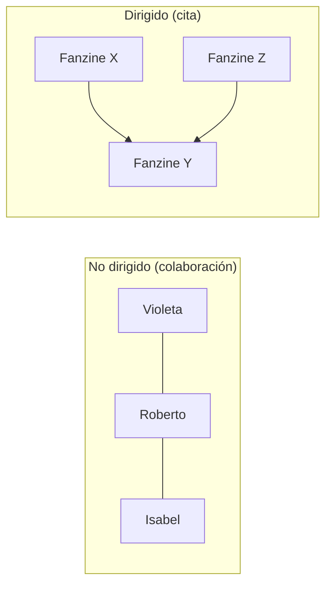
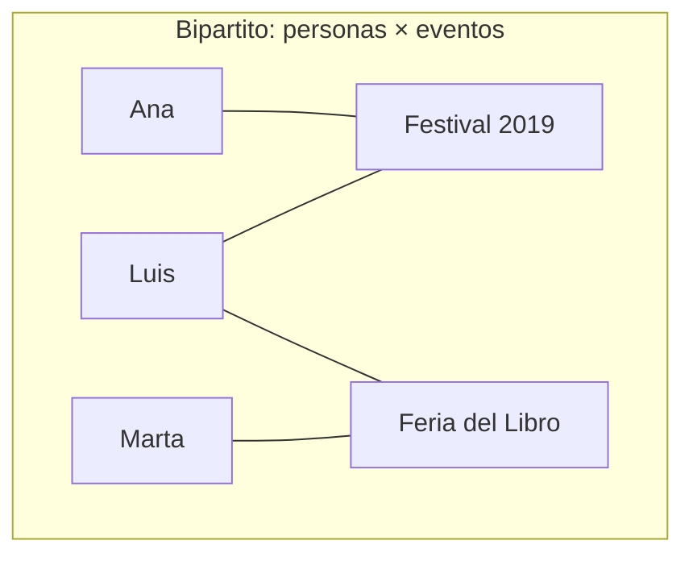
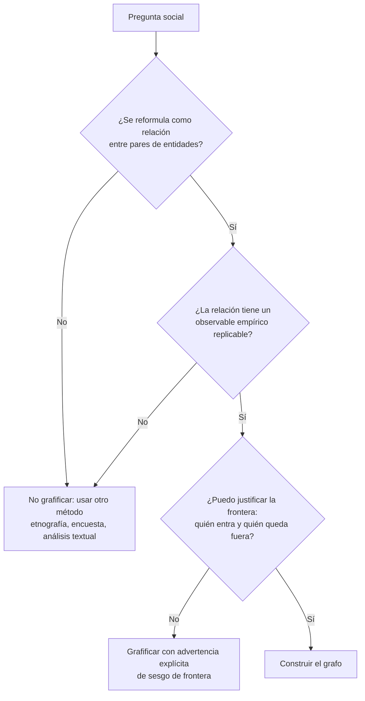
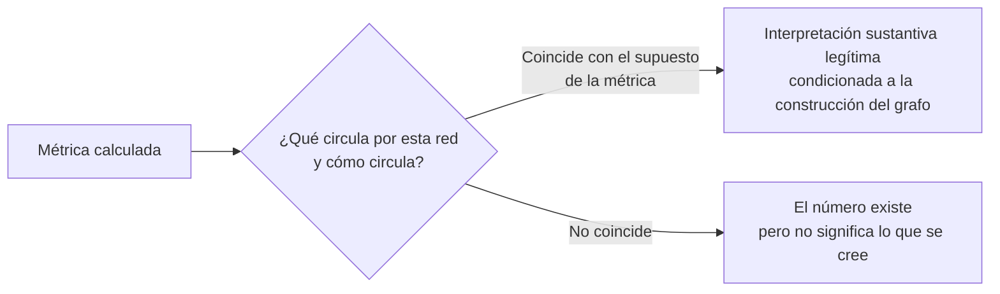
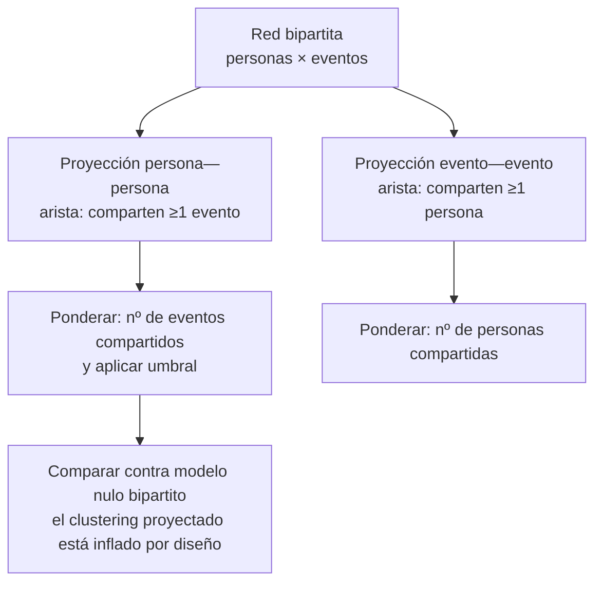
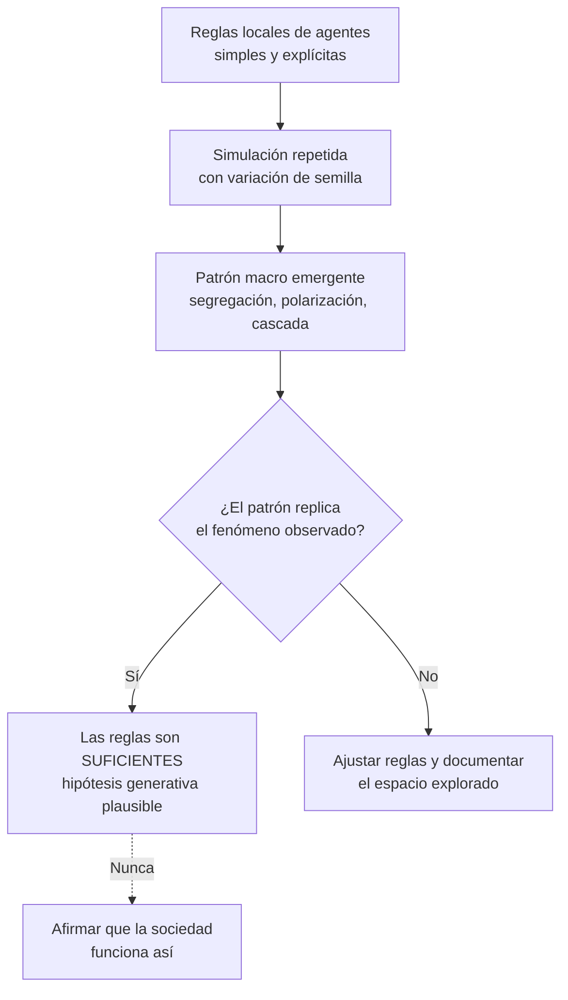
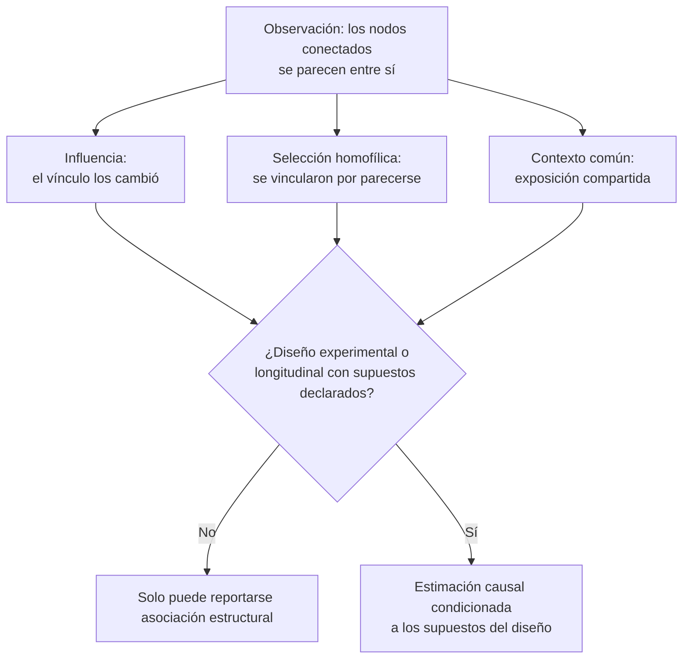
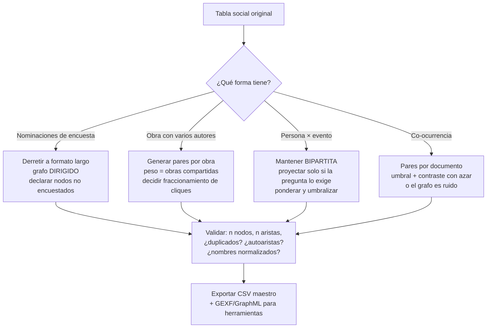

# Modelamiento con grafos y sistemas complejos aplicado a fenómenos culturales

**Documento fuente para curso de 30 lecciones (5 bloques × 6 lecciones)**
**Fecha:** 11 de agosto de 2026
**Idioma:** español (América Latina)
**Convención de evidencia:** toda afirmación empírica lleva [P] (fuente primaria: paper con datos y método, o libro del autor original) o [S] (síntesis o revisión secundaria). Las afirmaciones que circulan sin fuente rastreable fueron descartadas durante la redacción y no aparecen en este documento. Cuando un resultado célebre fue cuestionado o no replicó, se indica en el cuerpo del texto, no en nota al pie.

**Advertencia de tono que gobierna todo el curso:** un grafo es una representación, no una explicación. Modelar una escena musical como red no revela "la verdad" de esa escena; revela lo que las decisiones de construcción del grafo (qué es un nodo, qué es una arista, dónde se corta la frontera) permiten ver, y oculta todo lo demás. El curso enseña a construir, medir e interpretar redes, y con el mismo peso, a detectar cuándo una conclusión excede lo que la red puede sostener.

---

## Bloque 1 — Fundamentos: qué es un grafo y qué preguntas sociales admite

### 1.1 Definiciones mínimas de trabajo

Un **grafo** es un conjunto de **nodos** (también llamados vértices: personas, organizaciones, canciones, obras, barrios, conceptos) y un conjunto de **aristas** (relaciones entre pares de nodos: amistad, colaboración, cita, co-ocurrencia, membresía compartida). Esta formalización aplicada a lo social tiene un origen identificable: la sociometría de Jacob Moreno, que en *Who Shall Survive?* (1934) dibujó "sociogramas" de elecciones interpersonales en escuelas y comunidades [P]. La sistematización matemática moderna del análisis de redes sociales está consolidada en Wasserman y Faust, *Social Network Analysis: Methods and Applications* (1994, Cambridge University Press) [S], y en Newman, *Networks: An Introduction* (2010, Oxford University Press) [S], que son los dos manuales de referencia de este curso.

Variantes que el estudiante debe distinguir desde la lección 1:

| Tipo de grafo | Definición operativa | Ejemplo cultural | Pregunta que habilita |
|---|---|---|---|
| **No dirigido** | La relación es simétrica: si A—B, entonces B—A | Dos músicos tocaron en el mismo disco | ¿Quiénes están conectados? |
| **Dirigido** | La relación tiene sentido: A→B no implica B→A | Un fanzine cita a otro; una cuenta sigue a otra | ¿Quién presta atención a quién? ¿Hay asimetrías? |
| **Ponderado** | Cada arista tiene un peso numérico | Número de discos grabados juntos | ¿Qué vínculos son fuertes y cuáles ocasionales? |
| **Bipartito** | Dos clases de nodos; las aristas solo cruzan entre clases | Personas × eventos (asistió a), autores × revistas (publicó en) | ¿Qué estructura emerge de la afiliación compartida? |
| **Multigrafo / multiplex** | Varios tipos de arista entre los mismos nodos | Parentesco + negocios + padrinazgo entre las mismas familias | ¿Coinciden o divergen las distintas relaciones? |

La **matriz de adyacencia** es la misma información en forma de tabla: una matriz A de tamaño n×n donde la celda A[i][j] vale 1 (o el peso) si existe arista de i a j, y 0 si no. En un grafo no dirigido la matriz es simétrica; en uno dirigido, no. Para redes sociales reales la matriz es casi siempre **rala** (la mayoría de las celdas son 0), lo que explica por qué en la práctica los datos se almacenan como **lista de aristas** y no como matriz.





### 1.2 Qué pregunta social se puede convertir en grafo, y cuál no

La condición para grafificar una pregunta es que pueda reformularse como **una relación observable entre pares de entidades discretas**. Este es el filtro que el curso aplica una y otra vez.

**Preguntas convertibles** (con la decisión de nodo/arista explícita):

| Pregunta social | Nodo | Arista | Tipo |
|---|---|---|---|
| ¿Cómo se estructura la cumbia peruana como campo de colaboración? | Músico | Tocaron en la misma grabación | No dirigido, ponderado |
| ¿Quién intermedia entre la academia chilena y la argentina en antropología? | Autor | Co-autoría | No dirigido |
| ¿Qué museos comparten tipologías de objetos? | Museo, tipo de objeto | El museo posee el tipo | Bipartito |
| ¿Cómo circulaban las noticias entre periódicos del siglo XIX? | Periódico | Reimpresión de texto | Dirigido |
| ¿Qué organizaciones culturales comparten financistas? | Organización, financista | Financia a | Bipartito |

**Preguntas NO convertibles directamente** (y por qué):

1. **"¿Por qué esta tradición tiene el significado que tiene?"** — El significado no es una relación diádica; requiere interpretación hermenéutica. Un grafo puede mapear quién transmite la tradición a quién, no qué significa.
2. **"¿Es esta escena musical 'auténtica'?"** — "Autenticidad" es una categoría en disputa entre actores, no un atributo medible de nodos o aristas.
3. **"¿Cuánto influye la clase social en el gusto?"** — Tal cual está formulada, es una pregunta de regresión sobre atributos individuales, no de estructura relacional. Se vuelve grafificable solo si se reformula: "¿los vínculos de amistad conectan preferentemente a personas de gustos similares?" — y aun así, ver Bloque 5 sobre la confusión homofilia/influencia.
4. **Preguntas donde la "relación" no tiene observable empírico** — "red de influencias estéticas" entre pintores muertos, si la arista se asigna por juicio del investigador sin criterio replicable, produce un grafo que solo formaliza la opinión de quien lo dibujó.

**Regla de oro del curso:** antes de abrir cualquier herramienta, el estudiante debe poder completar la frase *"un nodo es ___, existe una arista entre dos nodos cuando ___, y observo esa relación mediante ___"*. Si la tercera parte no se puede llenar, no hay grafo, hay metáfora.



### 1.3 Decisiones de construcción que determinan todo lo demás

Tres decisiones anteceden a cualquier métrica, y el curso las trata como contenido central, no como trámite:

- **Definición de nodo:** ¿el nodo es la persona o la banda? ¿el museo o el objeto? Cambiar la unidad cambia la red completa.
- **Definición de arista y umbral:** en co-ocurrencia, ¿basta aparecer una vez juntos o se exige un mínimo? Los grafos de co-ocurrencia sin umbral tienden a densificarse hasta volverse ilegibles y engañosos.
- **Frontera de la red:** el "boundary specification problem" fue formulado por Laumann, Marsden y Prensky ("The boundary specification problem in network analysis", en *Applied Network Analysis*, Sage, 1983) [P]: los resultados estructurales dependen de a quién se decidió incluir, y esa decisión rara vez es neutral. Se retoma con datos en el Bloque 5.

---

## Bloque 2 — Métricas: qué afirman sobre lo social y cómo se malinterpretan

La clarificación conceptual de las centralidades viene de Freeman ("Centrality in social networks: conceptual clarification", *Social Networks* 1, 1979) [P], y la advertencia decisiva de que **cada centralidad presupone un modelo de flujo** (qué circula por la red y cómo) viene de Borgatti ("Centrality and network flow", *Social Networks* 27, 2005) [P]. Esa advertencia gobierna este bloque: una métrica no "mide importancia"; mide una posición bajo un supuesto sobre cómo circula algo (información, prestigio, recursos, repertorio). Si el supuesto no aplica al fenómeno cultural estudiado, el número no significa lo que se cree.

| Métrica | Definición operativa | Afirmación sustantiva que habilita | Malinterpretación más común |
|---|---|---|---|
| **Grado** (degree) | Número de aristas de un nodo (en dirigidas: grado de entrada y de salida por separado) | Volumen de actividad relacional directa: quién colabora, cita o convoca más | Tratarlo como "influencia" o "prestigio". Un promotor que conoce a todos puede tener grado altísimo y cero peso en las decisiones estéticas de la escena |
| **Intermediación** (betweenness) | Fracción de caminos más cortos entre pares de nodos que pasan por el nodo | Posición de puente: potencial de controlar o facilitar el flujo entre partes que no se conectan directamente | Suponer que el puente *efectivamente* transmite. La métrica mide posición geodésica, no uso: la información cultural rara vez viaja solo por caminos más cortos (Borgatti 2005) [P] |
| **Cercanía** (closeness) | Inverso de la distancia promedio a todos los demás nodos | Velocidad potencial de acceso al conjunto de la red: quién puede enterarse antes | Aplicarla a redes con varios componentes (no está definida entre componentes desconectados) o leerla como popularidad. Además discrimina poco: sus valores suelen concentrarse en un rango estrecho |
| **Eigenvector / PageRank** | Centralidad proporcional a la centralidad de los vecinos (Bonacich, "Power and centrality: a family of measures", *AJS* 92, 1987) [P] | Prestigio recursivo: estar conectado a los bien conectados. Útil para campos donde el estatus se hereda del vínculo (padrinazgos artísticos, citas) | Usarla en redes dirigidas con fuentes sin entradas (colapsa a cero en zonas enteras; PageRank existe precisamente para corregir eso) o leerla como grado "mejorado" |
| **Densidad** | Aristas existentes / aristas posibles | Cohesión global: cuánto del potencial relacional está realizado | Comparar densidades entre redes de distinto tamaño. La densidad cae mecánicamente con n (nadie puede sostener 10.000 amistades); comparar la densidad de una escena de 40 personas con una de 4.000 no informa nada |
| **Componentes** | Subconjuntos máximos internamente conectados | Fragmentación del campo: ¿es "la escena" una sola conversación o varias islas? | Concluir separación social real cuando la fragmentación es artefacto de datos faltantes: aristas no observadas parten componentes (ver Kossinets 2006, Bloque 5) |
| **Distancia / diámetro** | Longitud del camino más corto entre dos nodos; el máximo de esas longitudes | Alcance estructural: a cuántos pasos está cualquier actor de cualquier otro | Asumir que distancia corta = transmisión efectiva. Que exista un camino de 3 pasos entre dos poetas no implica que algo haya viajado por él |
| **Clustering** (transitividad) | Proporción de tríadas cerradas: cuán probable es que dos vecinos de un nodo estén conectados entre sí | Cierre local: mundos densos de conocimiento mutuo, típicos de comunidades de práctica | Leer clustering alto como "comunidad sana" o cohesión normativa. El cierre también encierra: puede indicar endogamia y redundancia informativa (Burt 1992, Bloque 3) |

### 2.1 Tres anclajes sustantivos con fuente primaria

**Fuerza de los lazos débiles.** Granovetter ("The strength of weak ties", *American Journal of Sociology* 78, 1973) [P] mostró, con datos de búsqueda de empleo en Boston, que la información nueva llega desproporcionadamente por lazos débiles, porque los lazos fuertes conectan a gente que ya sabe lo mismo. Traducción cultural directa: en una escena artística, los conocidos ocasionales de otras escenas son el canal probable de repertorios nuevos. Precisión que el curso debe hacer: Granovetter documentó el mecanismo para información de empleo; su extensión a cualquier contenido cultural es hipótesis razonable, no resultado del paper. Y para conductas costosas, el hallazgo se invierte (contagio complejo, Bloque 4).

**Grado no es influencia.** El experimento de mercados culturales artificiales de Salganik, Dodds y Watts ("Experimental study of inequality and unpredictability in an artificial cultural market", *Science* 311, 2006) [P] mostró que el éxito de canciones idénticas varía enormemente entre "mundos" según la influencia social visible: la popularidad es en parte producto de dinámicas de retroalimentación, no solo de cualidades del nodo. Implicación para las métricas: un grado alto puede ser efecto acumulado de azar temprano amplificado, no evidencia de calidad ni de liderazgo.

**Interpretación posicional, no individual.** Toda métrica de centralidad es un atributo **relacional**: cambia si cambia la red, sin que el actor haga nada. El curso exige que cada interpretación escrita de una métrica incluya la frase "dado cómo construí esta red". Borgatti, Everett y Johnson, *Analyzing Social Networks* (Sage, 2013) [S] es la referencia pedagógica para este hábito.



### 2.2 Métricas en la práctica: qué reportar

Estándar mínimo de reporte que el curso impone para cualquier análisis: n de nodos, n de aristas, dirigido/no dirigido, ponderado o no, densidad, número de componentes, tamaño del componente gigante, y las tres centralidades que respondan a la pregunta (no las ocho por defecto). Reportar todas las métricas que el software escupe es el equivalente en redes de la pesca de p-valores.

---

## Bloque 3 — Estructura: comunidades, homofilia, agujeros, núcleo-periferia, afiliación

### 3.1 Detección de comunidades: Louvain y Leiden

Las comunidades son particiones del grafo que maximizan la **modularidad**: más aristas dentro de los grupos de las que se esperarían al azar. El algoritmo de Louvain (Blondel, Guillaume, Lambiotte y Lefebvre, "Fast unfolding of communities in large networks", *Journal of Statistical Mechanics*, 2008) [P] es el estándar histórico por su velocidad. Leiden (Traag, Waltman y van Eck, "From Louvain to Leiden: guaranteeing well-connected communities", *Scientific Reports* 9, 2019) [P] lo corrige: demostró que Louvain puede producir comunidades internamente **desconectadas** (un defecto grave, no cosmético) y garantiza comunidades conectadas. Recomendación operativa del curso: usar Leiden; ambos están en igraph y en el paquete `leidenalg` de Python.

Cuatro advertencias con fuente, que el curso convierte en lecciones:

1. **Límite de resolución:** la maximización de modularidad no puede detectar comunidades pequeñas en redes grandes; las fusiona (Fortunato y Barthélemy, "Resolution limit in community detection", *PNAS* 104, 2007) [P].
2. **No determinismo:** Louvain/Leiden dan particiones distintas según el orden de procesamiento. Correr el algoritmo una vez y reportar "las comunidades de la red" es mala práctica; se corre varias veces y se examina la estabilidad.
3. **Las comunidades no son "grupos reales":** Peel, Larremore y Clauset ("The ground truth about metadata and community detection", *Science Advances* 3, 2017) [P] demostraron que las particiones estructurales no tienen por qué coincidir con las categorías sociales (género, género musical, institución) y que esa discrepancia no es un error: estructura y metadatos capturan cosas distintas.
4. Revisión técnica general: Fortunato, "Community detection in graphs", *Physics Reports* 486, 2010 [S].

**Interpretación cultural correcta:** una comunidad detectada es una hipótesis de subcampo que hay que validar contra conocimiento del terreno, no un descubrimiento de "las tribus reales" de la escena.

### 3.2 Homofilia

Homofilia: los vínculos conectan desproporcionadamente a similares. La revisión canónica es McPherson, Smith-Lovin y Cook ("Birds of a feather: homophily in social networks", *Annual Review of Sociology* 27, 2001) [S], que sintetiza evidencia de homofilia por raza/etnia, edad, religión, educación y ocupación en decenas de estudios. Para cultura específicamente, Lizardo ("How cultural tastes shape personal networks", *American Sociological Review* 71, 2006) [P] usó datos de encuesta estadounidense (GSS) para mostrar que los gustos culturales no solo reflejan las redes: también las **producen**, y de forma diferenciada — la cultura "popular" facilita lazos débiles amplios y la cultura "de alta legitimidad" facilita lazos fuertes. DiMaggio ("Classification in art", *American Sociological Review* 52, 1987) [P] provee el marco: los géneros artísticos funcionan como sistemas de clasificación ritual que organizan la interacción social.

Distinción que se mide, no se declara: homofilia **de elección** (preferir similares) vs. homofilia **inducida** (la estructura de oportunidades solo ofrece similares: barrios, escuelas, escenas segregadas). Con datos transversales son indistinguibles — este es el puente hacia el problema homofilia/influencia del Bloque 5.

### 3.3 Agujeros estructurales

Burt (*Structural Holes: The Social Structure of Competition*, Harvard University Press, 1992) [P]: la ventaja competitiva está en tender puentes sobre "agujeros" entre grupos no conectados, porque quien puentea accede a información no redundante y controla el flujo. Burt ("Structural holes and good ideas", *American Journal of Sociology* 110, 2004) [P] lo testeó con datos de managers de una empresa: las ideas evaluadas como buenas provenían desproporcionadamente de quienes puenteaban agujeros. Lectura cultural: los intermediarios entre escenas (el productor que conecta el folclor con la electrónica) ocupan agujeros estructurales; la teoría predice que ahí se genera recombinación. Límite honesto: la evidencia de Burt es organizacional/empresarial; su traslado a campos artísticos es analogía plausible con soporte parcial (el caso Broadway de 3.5 apunta en la misma dirección).

Contraste pedagógico clave: **cierre (Coleman) vs. puente (Burt)**. El cierre genera confianza y sanción normativa; el puente genera novedad. Ninguno es "mejor": depende de si el problema del campo es cooperación o innovación.

### 3.4 Núcleo-periferia

Borgatti y Everett ("Models of core/periphery structures", *Social Networks* 21, 1999) [P] formalizaron la intuición: un núcleo denso y cohesionado, una periferia conectada al núcleo pero no entre sí. Es un modelo que se **ajusta y evalúa** (cuán bien la red observada se aproxima a la matriz ideal), no una etiqueta que se asigna a ojo. En campos culturales, el patrón núcleo-periferia es la firma estructural de la consagración: pocos actores centrales concentran colaboración y reconocimiento. El mecanismo generador plausible es la ventaja acumulativa o "efecto Mateo" (Merton, "The Matthew effect in science", *Science* 159, 1968) [P]: el reconocimiento fluye hacia los ya reconocidos.

### 3.5 Redes bipartitas de afiliación cultural

El fundamento teórico es Breiger ("The duality of persons and groups", *Social Forces* 53, 1974) [P]: las personas se conectan a través de los grupos y los grupos a través de las personas; ambas proyecciones son caras del mismo dato. De una red bipartita personas×eventos se derivan dos proyecciones: persona—persona (comparten evento) y evento—evento (comparten personas).

**El caso primario del curso:** Uzzi y Spiro ("Collaboration and creativity: the small world problem", *American Journal of Sociology* 111, 2005) [P] construyeron la red bipartita de artistas × musicales de Broadway (1945–1989) y midieron cómo el grado de "mundo pequeño" del campo (clustering alto + distancias cortas) se relaciona con el éxito artístico y financiero: la relación es de **U invertida** — algo de cohesión ayuda a la creatividad, demasiada la asfixia por redundancia. Es el mejor ejemplo publicado de una métrica global de red usada como variable explicativa sobre producción cultural.

**Advertencia técnica obligatoria:** la proyección de una red bipartita **infla el clustering mecánicamente** (cada evento de k asistentes genera un clique de k nodos en la proyección). Medir clustering sobre una proyección y celebrarlo como cohesión social es uno de los errores más frecuentes del área; hay que compararlo contra un modelo nulo bipartito, no contra un aleatorio simple.



| Concepto estructural | Firma en el grafo | Mecanismo social candidato | Qué NO permite concluir |
|---|---|---|---|
| Comunidades | Bloques densos, pocas aristas entre bloques | Subcampos, escenas locales, círculos de reconocimiento | Que los bloques coincidan con categorías identitarias (Peel et al. 2017) [P] |
| Homofilia | Aristas correlacionadas con similitud de atributos | Elección de similares **o** estructura de oportunidades | Cuál de los dos mecanismos opera (con datos transversales) |
| Agujero estructural | Nodo que conecta clusters no conectados entre sí | Corretaje, importación de repertorios | Que el broker efectivamente use la posición |
| Núcleo-periferia | Ajuste alto al modelo ideal de Borgatti-Everett | Consagración, ventaja acumulativa | Que el núcleo sea "mejor" artísticamente |
| Afiliación bipartita | Dos clases de nodos, aristas entre clases | Dualidad persona/grupo (Breiger 1974) [P] | Cohesión leída de proyecciones sin modelo nulo |

---

## Bloque 4 — Dinámica y sistemas complejos

### 4.1 Topologías de referencia: mundo pequeño y escala libre

Watts y Strogatz ("Collective dynamics of 'small-world' networks", *Nature* 393, 1998) [P]: con pocas aristas "recableadas" al azar, una red muy agrupada adquiere distancias cortas — clustering alto + caminos cortos simultáneamente, la combinación típica de redes sociales reales. Barabási y Albert ("Emergence of scaling in random networks", *Science* 286, 1999) [P]: el crecimiento con **conexión preferencial** (los nuevos nodos se enganchan a los ya conectados) genera distribuciones de grado de cola pesada: pocos hubs, muchos nodos de grado bajo. Matiz obligatorio: la afirmación de que "todas las redes reales son de escala libre" fue testeada masivamente y resultó exagerada — Broido y Clauset ("Scale-free networks are rare", *Nature Communications* 10, 2019) [P] encontraron que las leyes de potencia estrictas son raras en casi mil redes empíricas. Lo robusto y útil para el curso es la **heterogeneidad de grado** (colas pesadas), no la ley de potencia exacta.

### 4.2 Difusión, umbrales y contagio complejo

Granovetter ("Threshold models of collective behavior", *American Journal of Sociology* 83, 1978) [P]: cada persona tiene un umbral (la fracción de otros que deben adoptar antes de que ella adopte); la distribución de umbrales determina si una conducta colectiva despega o muere, y distribuciones casi idénticas producen resultados opuestos — primera lección de no linealidad.

Centola y Macy ("Complex contagions and the weakness of long ties", *American Journal of Sociology* 113, 2007) [P] distinguieron **contagio simple** (basta una exposición: información, un rumor) de **contagio complejo** (se requiere refuerzo de múltiples contactos: conductas costosas, riesgosas o que exigen legitimación — participar en una protesta, adoptar una práctica estigmatizada). Consecuencia estructural: los lazos débiles y los puentes largos, óptimos para contagio simple, son **malos** para contagio complejo, que necesita cierre y redundancia. Centola ("The spread of behavior in an online social network experiment", *Science* 329, 2010) [P] lo confirmó experimentalmente: una conducta de salud se difundió más y más rápido en redes agrupadas que en redes aleatorias. Para cultura, la hipótesis de trabajo es que la adopción de prácticas identitarias (vestimenta de una subcultura, participación ritual) opera como contagio complejo, mientras que enterarse de un concierto opera como contagio simple — el curso lo presenta como hipótesis a evaluar caso a caso, no como ley.

**El episodio de no replicación que el curso cuenta completo:** Christakis y Fowler ("The spread of obesity in a large social network over 32 years", *NEJM* 357, 2007) [P] afirmaron que la obesidad (y luego el tabaquismo y la felicidad) "se contagia" hasta a tres grados de distancia. El resultado fue cuestionado de raíz: Lyons ("The spread of evidence-poor medicine via flawed social-network analysis", *Statistics, Politics, and Policy* 2, 2011) [P] mostró problemas estadísticos graves (incluidos coeficientes direccionales incompatibles con el modelo causal declarado), y Shalizi y Thomas ("Homophily and contagion are generically confounded in observational social network studies", *Sociological Methods & Research* 40, 2011) [P] demostraron formalmente que con datos observacionales homofilia latente y contagio son **genéricamente indistinguibles**. Estado honesto de la literatura: la influencia social existe (los experimentos de Centola y Salganik la aíslan), pero las estimaciones observacionales de "contagio" de rasgos y conductas están confundidas por diseño. Aral, Muchnik y Sundararajan ("Distinguishing influence-based contagion from homophily-driven diffusion in dynamic networks", *PNAS* 106, 2009) [P] estimaron con matching dinámico que los métodos ingenuos pueden sobreestimar la influencia por un factor de ~3 a 7.

### 4.3 Redes temporales

Una red agregada en el tiempo miente sobre la difusión: si A—B existió en 2010 y B—C en 2015, en el grafo agregado hay un camino A→C que **nunca estuvo disponible** para transmitir nada de C hacia A. Los caminos respetando orden temporal ("time-respecting paths") son el objeto correcto para preguntas de circulación. Revisión de referencia: Holme y Saramäki ("Temporal networks", *Physics Reports* 519, 2012) [S]. Regla operativa del curso: toda pregunta de difusión exige aristas con marca de tiempo o, al menos, cortes por período (la red 2000–2005 vs. 2005–2010), nunca el agregado total.

### 4.4 Modelos basados en agentes (ABM) y emergencia

Un ABM especifica agentes con reglas locales simples y observa qué patrón global **emerge** sin que nadie lo haya diseñado. Los tres modelos canónicos del curso, todos replicables en NetLogo (gratuito) o Mesa (Python):

1. **Segregación de Schelling** ("Dynamic models of segregation", *Journal of Mathematical Sociology* 1, 1971) [P]: agentes con preferencias leves por vecinos similares producen segregación espacial severa. Lección: el patrón macro no refleja proporcionalmente las preferencias micro.
2. **Diseminación cultural de Axelrod** ("The dissemination of culture: a model with local convergence and global polarization", *Journal of Conflict Resolution* 41, 1997) [P]: agentes que interactúan más con similares y se asimilan al interactuar generan, contraintuitivamente, regiones culturales homogéneas **y** fronteras estables de polarización global. La convergencia local produce diversidad global.
3. **Sugarscape** de Epstein y Axtell (*Growing Artificial Societies*, MIT Press/Brookings, 1996) [P]: fundó el programa de "sociedades artificiales" — desigualdad, migración y formación de grupos emergiendo de reglas mínimas.

**Qué es un ABM epistemológicamente:** un experimento de suficiencia ("estas reglas *bastan* para generar este patrón"), no una demostración de que la sociedad real funciona así. Confundir suficiencia con explicación es el error rector del área.

### 4.5 Path dependence y criticidad

**Path dependence:** Arthur ("Competing technologies, increasing returns, and lock-in by historical events", *Economic Journal* 99, 1989) [P] formalizó cómo, con retornos crecientes, accidentes históricos tempranos quedan "bloqueados" (lock-in) aunque existan alternativas superiores. El experimento MusicLab (Salganik et al. 2006, ya citado) [P] es exactamente esto en cultura: mundos con las mismas canciones convergen a rankings distintos e impredecibles según el azar temprano amplificado. Implicación fuerte: la canonización cultural es parcialmente contingente, y la posición final en la red no certifica mérito.

**Cascadas y criticidad:** Watts ("A simple model of global cascades on random networks", *PNAS* 99, 2002) [P] mostró que en modelos de umbral sobre redes, cascadas globales raras y enormes pueden dispararse desde perturbaciones idénticas a miles que no produjeron nada: el sistema cerca de un punto crítico hace que "por qué esto se volvió viral" sea, en parte, una pregunta sin respuesta a nivel del contenido. Precaución del curso: "criticidad auto-organizada" se invoca en ciencias sociales mucho más de lo que se demuestra; el curso la presenta como propiedad de **modelos** que ilustra por qué los tamaños de los fenómenos culturales son tan desiguales, no como hecho establecido sobre la sociedad.

| Concepto dinámico | Modelo fuente | Qué demuestra | Qué NO demuestra |
|---|---|---|---|
| Umbrales | Granovetter 1978 [P] | Micro-preferencias casi iguales → resultados colectivos opuestos | Que se puedan medir umbrales individuales reales con facilidad |
| Contagio simple vs. complejo | Centola & Macy 2007 [P]; Centola 2010 [P] | Conductas costosas se difunden mejor con redundancia local | Que toda práctica cultural sea contagio complejo |
| Contagio observacional | Christakis & Fowler 2007 [P] → refutación: Lyons 2011, Shalizi & Thomas 2011 [P] | (Cuestionado) | Influencia causal a partir de correlación en red observacional |
| Emergencia | Schelling 1971; Axelrod 1997; Epstein & Axtell 1996 [P] | Suficiencia generativa de reglas locales | Que esas reglas sean las que operan en la realidad |
| Path dependence | Arthur 1989 [P]; Salganik et al. 2006 [P] | El azar temprano amplificado produce lock-in cultural | Que el mérito no juegue ningún rol |
| Cascadas críticas | Watts 2002 [P] | Estímulos idénticos → resultados de tamaño radicalmente distinto | Que la viralidad sea predecible desde el contenido |



---

## Bloque 5 — Alcances y límites: lo que estas herramientas no pueden hacer

Este bloque no es un apéndice de humildad: son seis lecciones con la misma jerarquía que las demás. Un curso que enseña a calcular intermediación sin enseñar el problema de frontera produce analistas peligrosos.

### 5.1 Homofilia vs. influencia: la confusión constitutiva

Ya presentada en 4.2, aquí se formula como regla: **con datos observacionales de red, "los conectados se parecen" admite siempre tres explicaciones — influencia (el vínculo cambió a las personas), selección homofílica (los parecidos se vincularon) y contexto común (ambos expuestos a lo mismo) — y las tres son genéricamente indistinguibles** (Shalizi y Thomas 2011) [P]. Salidas parciales: experimentos (Centola 2010; Salganik et al. 2006) [P], datos longitudinales con supuestos fuertes (Aral et al. 2009) [P], o renunciar a la afirmación causal y reportar asociación estructural, que es lo que este curso recomienda por defecto.

### 5.2 Falacia ecológica

Robinson ("Ecological correlations and the behavior of individuals", *American Sociological Review* 15, 1950) [P] mostró con datos censales estadounidenses que las correlaciones a nivel agregado pueden diferir en magnitud y hasta en signo de las correlaciones individuales. Versión en redes: propiedades de una **comunidad detectada** (la comunidad X consume más folclor) no licencian afirmaciones sobre sus **miembros individuales**; y propiedades de la red total (la escena es densa) no describen la experiencia de ningún nodo. El salto de nivel debe declararse siempre.

### 5.3 Datos faltantes y frontera de la red

Kossinets ("Effects of missing data in social networks", *Social Networks* 28, 2006) [P] cuantificó, con datos reales perturbados sistemáticamente, cómo la no respuesta, la especificación de frontera y el censado parcial de aristas **sesgan las métricas: distorsionan grado y centralidades, fragmentan componentes e inflan o desinflan el clustering**. Combinado con Laumann et al. (1983) [P]: la frontera de "la escena del rock chileno" no existe en la naturaleza; la dibuja el investigador, y los nodos cerca del borde tienen centralidades artificialmente bajas porque sus vínculos hacia afuera fueron amputados. Práctica obligatoria del curso: todo análisis reporta cómo se definió la frontera y qué porcentaje estimado de la relación quedó fuera; y los nodos de borde se interpretan con desconfianza explícita. Marsden ("Network data and measurement", *Annual Review of Sociology* 16, 1990) [S] revisa los problemas de medición de base (incluida la baja confiabilidad del auto-reporte de vínculos).

### 5.4 Plataformas digitales como proxy sesgado de lo social

Cuatro fuentes definen la posición del curso:

- boyd y Crawford ("Critical questions for big data", *Information, Communication & Society* 15, 2012) [P]: los datos masivos no son objetivos ni exhaustivos; están pre-estructurados por las plataformas y su acceso es desigual.
- Tufekci ("Big questions for social media big data: representativeness, validity and other methodological pitfalls", *ICWSM*, 2014) [P]: sesgo de selección de plataforma (quién está en Twitter no es "la sociedad"), sesgo del hashtag (medir el hashtag no es medir el movimiento), y el problema del "organismo modelo": estudiar lo fácil de recolectar como si fuera lo representativo.
- Morstatter, Pfeffer, Liu y Carley ("Is the sample good enough? Comparing data from Twitter's streaming API with Twitter's firehose", *ICWSM*, 2013) [P]: la muestra gratuita de la API difería sistemáticamente del flujo completo — hallazgos de red construidos sobre APIs muestreadas heredan un sesgo no cuantificable desde fuera.
- Lazer et al. ("The parable of Google Flu Trends: traps in big data analysis", *Science* 343, 2014) [P]: los sistemas de las plataformas cambian bajo los pies del investigador ("algorithmic dynamics"); una red de "interacciones" en una plataforma mide en parte el algoritmo de recomendación, no la sociabilidad.

Regla del curso: una red de follows/likes/menciones es un registro de conducta **en esa plataforma, bajo ese diseño, en ese período**. Puede ser un objeto de estudio legítimo en sí mismo; lo que no puede es funcionar como espejo de "la estructura social" sin argumento explícito de por qué serviría de proxy.

### 5.5 Crítica a la cuantificación de la cultura

La cuantificación no es una ventana neutra: es una práctica social con efectos propios (Espeland y Stevens, "A sociology of quantification", *European Journal of Sociology* 49, 2008) [P/S — ensayo teórico primario]. La conmensuración (volver comparable lo distinto) descarta precisamente lo que hace culturalmente específico a un objeto. Sobre qué puede aportar la medición a la sociología de la cultura sin sustituir la interpretación: Mohr ("Measuring meaning structures", *Annual Review of Sociology* 24, 1998) [S] y Bail ("The cultural environment: measuring culture with big data", *Theory and Society* 43, 2014) [S]. La posición del curso, en una frase: **las redes formalizan la dimensión relacional de la cultura; el significado de esas relaciones requiere métodos interpretativos, y las mejores investigaciones combinan ambos** (el caso Padgett y Ansell del Bloque de casos es el ejemplo: años de historiografía florentina detrás de cada arista).

### 5.6 Tabla de límites (diagramable)

| Límite | Fuente | Error que previene | Práctica correctiva |
|---|---|---|---|
| Homofilia ≠ influencia | Shalizi & Thomas 2011 [P] | "La red contagió X" desde datos observacionales | Reportar asociación; causalidad solo con diseño experimental o longitudinal declarado |
| Falacia ecológica | Robinson 1950 [P] | Atribuir a individuos propiedades de comunidades | Declarar el nivel de análisis en cada afirmación |
| Datos faltantes | Kossinets 2006 [P] | Leer fragmentación o centralidad como hechos sociales | Análisis de sensibilidad; reportar cobertura estimada |
| Frontera | Laumann et al. 1983 [P] | Centralidades bajas en nodos de borde leídas como marginalidad | Justificar la frontera; desconfiar del borde |
| Plataforma como proxy | Tufekci 2014; Morstatter et al. 2013 [P] | "La red de Twitter de la escena" = "la escena" | Estudiar la plataforma como plataforma; triangular con otras fuentes |
| Conmensuración | Espeland & Stevens 2008 [P] | Confundir lo medible con lo importante | Combinar redes con métodos interpretativos |



---

## Herramientas gratuitas: pasos reales, no descripciones

Las cuatro herramientas del curso son gratuitas y multiplataforma. Ninguna lección depende de software de pago.

### Gephi (visualización y exploración interactiva) — gephi.org

Flujo de trabajo estándar que el curso repite hasta la automatización:

1. Preparar dos CSV: `aristas.csv` con columnas `Source,Target,Weight` (y `Type` = Undirected si aplica) y opcionalmente `nodos.csv` con `Id,Label` + atributos.
2. **File → Import spreadsheet** → importar primero nodos (como "Nodes table"), luego aristas ("Edges table"), marcando "Append to existing workspace" en la segunda importación.
3. Verificar en la ventana de importación: nº de nodos y aristas, dirigido/no dirigido. Aquí se detecta el 80% de los errores de construcción.
4. Pestaña **Overview**: correr un layout — ForceAtlas2 con "Prevent overlap" y, si la red es grande, "LinLog mode". Detenerlo manualmente (no converge solo).
5. Panel **Statistics** (derecha): correr Average Degree, Network Diameter (calcula betweenness y closeness), Modularity (Louvain), Avg. Clustering Coefficient.
6. Panel **Appearance** (izquierda): colorear nodos por Modularity Class (Partition), dimensionar por la centralidad elegida (Ranking).
7. Pestaña **Data Laboratory**: revisar los valores nodo por nodo — es una planilla; ahí se exportan las métricas a CSV.
8. Pestaña **Preview** → Refresh → exportar SVG/PDF/PNG.

Punto de fricción conocido: Gephi requiere Java; si no abre, instalar una JDK reciente. Segundo punto: el layout **no significa nada** métricamente — la posición x,y es estética; dos nodos cercanos en pantalla no están "socialmente cerca". El curso lo repite en cada lección con Gephi.

### NetworkX (Python) — análisis programático y reproducible

```python
import networkx as nx
import pandas as pd

# 1. De tabla a grafo
df = pd.read_csv("aristas.csv")            # columnas: origen, destino, peso
G = nx.from_pandas_edgelist(df, source="origen", target="destino",
                            edge_attr="peso")   # nx.DiGraph() como create_using= si es dirigida

# 2. Reporte mínimo
print(G.number_of_nodes(), G.number_of_edges(), nx.density(G))
comps = list(nx.connected_components(G))
gigante = G.subgraph(max(comps, key=len)).copy()

# 3. Métricas (sobre el componente gigante cuando corresponda)
grado = dict(G.degree())
inter = nx.betweenness_centrality(gigante)          # normalizada
cerca = nx.closeness_centrality(gigante)
eigen = nx.eigenvector_centrality(gigante, max_iter=1000)
clust = nx.average_clustering(G)

# 4. Comunidades (Leiden requiere: pip install leidenalg python-igraph)
#    En NetworkX puro: nx.community.louvain_communities(G, seed=42)

# 5. Exportar con métricas como atributos
nx.set_node_attributes(G, inter, "betweenness")
nx.write_gexf(G, "red_para_gephi.gexf")
```

Hábitos que el curso impone: fijar semillas (`seed=`), trabajar sobre el componente gigante para closeness/eigenvector, y guardar el script junto con los datos — el script **es** la documentación metodológica.

### igraph (R) — el estándar en ciencias sociales cuantitativas

```r
library(igraph)
df <- read.csv("aristas.csv")
g  <- graph_from_data_frame(df, directed = FALSE)

vcount(g); ecount(g); edge_density(g)
components(g)$csize

V(g)$grado <- degree(g)
V(g)$inter <- betweenness(g, normalized = TRUE)
V(g)$eigen <- eigen_centrality(g)$vector
transitivity(g, type = "global")

com <- cluster_leiden(g, objective_function = "modularity", n_iterations = 10)
table(membership(com))

write_graph(g, "red.graphml", format = "graphml")
```

Para redes bipartitas: `bipartite_projection(g)` tras marcar `V(g)$type`; para el modelo nulo bipartito, comparar contra grafos generados con `sample_bipartite()` conservando grados.

### Cytoscape (visualización avanzada, origen en biología) — cytoscape.org

Útil cuando se necesitan estilos visuales muy controlados o redes con muchos atributos. Flujo: **File → Import → Network from File** (acepta CSV de aristas, GraphML, GEXF vía apps); **File → Import → Table from File** para atributos de nodos; panel **Style** para mapear atributos a color/tamaño/forma con reglas discretas o continuas; **Tools → Analyze Network** para métricas básicas; **Layout → Prefuse Force Directed**. Su App Store agrega detección de comunidades (clusterMaker2). En el curso es la herramienta secundaria: se enseña una lección, con Gephi como estándar visual.

## Formatos de datos y el paso crítico: de tabla social a grafo

### Formatos

| Formato | Qué es | Cuándo usarlo | Quién lo lee |
|---|---|---|---|
| **Lista de aristas (CSV)** | Una fila por relación: `origen,destino,peso` | Siempre como formato de origen y de intercambio; es legible por humanos y control de versiones | Todos |
| **GEXF** | XML con nodos, aristas, atributos y soporte de dinámica temporal | Cuando se quiere conservar atributos y tiempos para Gephi | Gephi (nativo), NetworkX |
| **GraphML** | XML estándar con atributos tipados | Intercambio entre igraph, NetworkX, Cytoscape, Gephi | Todos |
| **CSV de nodos + CSV de aristas** | Dos tablas separadas | La forma más robusta de mantener atributos de nodos | Todos |

Regla práctica: los datos maestros viven como dos CSV (nodos y aristas); GEXF/GraphML son formatos de exportación, no de edición manual.

### De la tabla que uno tiene al grafo que uno necesita

Este es el paso donde la mayoría se traba, porque los datos sociales casi nunca llegan como lista de aristas. Cuatro situaciones cubren casi todos los casos:

**Caso 1 — Encuesta de nominaciones ("nombre a las 3 personas con las que...")**
La tabla tiene una fila por encuestado y columnas `nominado_1, nominado_2, nominado_3`. Transformación: "derretir" la tabla a formato largo — cada celda no vacía se vuelve una fila `encuestado → nominado`. El grafo resultante es **dirigido** (nominar no es recíproco) y la decisión metodológica clave es qué hacer con los nominados que no fueron encuestados (nodos sin grado de salida: están en la red pero su perspectiva falta — declarar esto siempre).

**Caso 2 — Co-autoría (o cualquier co-producción)**
La tabla tiene una fila por obra con autores en una celda separada por punto y coma, o una fila por par obra–autor. Transformación: por cada obra con autores {A, B, C}, generar todas las parejas: A—B, A—C, B—C (en pandas: agrupar por obra y aplicar `itertools.combinations`). El peso de la arista es el número de obras compartidas. Decisión clave: las obras con muchos autores generan cliques enormes que dominan la red — o se ponderan las aristas por 1/(k−1) por obra (fraccionamiento) o se declara que no se hizo.

**Caso 3 — Participación en eventos (afiliación)**
La tabla tiene filas `persona, evento`. Aquí la recomendación firme del curso es **mantener la red bipartita** como objeto primario y proyectar solo cuando la pregunta lo exija, recordando la inflación de clustering (Bloque 3.5). La proyección es una pérdida de información: dos personas que compartieron 1 evento de 500 asistentes y dos que compartieron 15 talleres de 6 personas quedan igualadas si no se pondera y umbraliza.

**Caso 4 — Co-ocurrencia en textos o catálogos**
Filas `documento, término` (o `objeto de museo, descriptor`). Misma mecánica que el Caso 2, con un peligro adicional: la co-ocurrencia produce redes densísimas donde casi todo se conecta con casi todo. Sin umbral de peso mínimo y sin comparar contra la co-ocurrencia esperada por azar (por ejemplo, con una medida tipo PMI), el grafo resultante es ruido con estética de red.



El punto de la validación final merece subrayarse: la causa número uno de redes basura es la **no normalización de nombres** ("Violeta Parra", "V. Parra", "Parra, Violeta" son tres nodos distintos para el software). Antes de cualquier métrica: minúsculas, sin tildes para el matching, deduplicación revisada a mano, y una columna `Id` estable separada de `Label`.

---

## Conjuntos de datos abiertos para fenómenos culturales latinoamericanos

Verificados como accesibles a la fecha del documento. Los tamaños son órdenes de magnitud, no cifras exactas.

| # | Dataset | URL | Contenido y tamaño | Licencia / acceso | Pregunta cultural que permite |
|---|---|---|---|---|---|
| 1 | **OpenAlex** | https://openalex.org (API y volcado completo) | Catálogo bibliográfico global: cientos de millones de obras con autores, instituciones y referencias; filtrable por país e institución latinoamericana | CC0; API gratuita sin llave | Red de co-autoría de un campo (p. ej., musicología en Chile y Argentina): ¿quién intermedia entre países? ¿núcleo-periferia institucional? |
| 2 | **MusicBrainz** | https://musicbrainz.org (API y volcados en https://musicbrainz.org/doc/MusicBrainz_Database) | Base de datos musical colaborativa: artistas, grabaciones, créditos de participación; millones de entidades | Datos centrales en CC0/dominio público | Red de colaboración de una escena (cumbia, rock andino): bipartita artista×grabación, proyección ponderada |
| 3 | **Discogs (volcados mensuales)** | https://data.discogs.com | Discografías con créditos detallados por lanzamiento (músicos de sesión, productores, sellos); XML mensual, decenas de GB completo (se filtra por país/género) | CC0 | Colaboración músico–productor–sello en un género latinoamericano a lo largo de décadas; redes temporales por año de lanzamiento |
| 4 | **Wikidata** | https://www.wikidata.org (endpoint SPARQL: https://query.wikidata.org) | Grafo de conocimiento: pintores, escritores, museos, sitios patrimoniales latinoamericanos con propiedades relacionales (alumno de, movimiento, colección) | CC0 | Redes maestro–discípulo o artista–institución en el arte latinoamericano; bipartita obra×museo |
| 5 | **Acervos Ibram – Tainacan (Brasil)** | Portales de museos del Ibram sobre plataforma Tainacan, índice en https://www.gov.br/museus (Acervos Online) | Catálogos digitalizados de museos nacionales brasileños (Museu Histórico Nacional, Museu da República y otros), con metadatos estandarizados exportables | Plataforma de software libre; metadatos de acceso público, verificar licencia por museo | Red bipartita museo×tipología de objeto: ¿qué museos comparten perfiles de colección? ¿cómo se estructura el patrimonio musealizado? |
| 6 | **Hemeroteca Nacional Digital de México (HNDM)** | https://hndm.iib.unam.mx | ~9 millones de páginas de prensa mexicana desde 1722; los títulos en dominio público (siglos XVIII–XIX) son de libre acceso en línea | Acceso libre para dominio público; el resto solo en sala | Red dirigida de reimpresión/circulación de textos entre periódicos del siglo XIX; co-ocurrencia de actores públicos en prensa |
| 7 | **Memoria Chilena / Biblioteca Nacional Digital de Chile** | https://www.memoriachilena.gob.cl y https://www.bibliotecanacionaldigital.gob.cl | Colecciones digitalizadas de patrimonio chileno: prensa histórica, cancioneros y lira popular, folletería | Acceso libre; obras mayormente en dominio público, citar según condiciones del sitio | Red de imprentas, autores y pliegos de la Lira Popular; co-ocurrencia temática en cancioneros folclóricos |
| 8 | **IPUMS International** | https://international.ipums.org | Microdatos censales armonizados de múltiples países latinoamericanos (Brasil, México, Chile, Argentina, Colombia, entre otros), millones de registros por censo | Gratuito con registro; uso de investigación, no redistribuible | Contexto y atributos para redes: composición de barrios/regiones donde viven los actores culturales; insumo para modelos tipo Schelling calibrados |

Nota metodológica que acompaña la tabla en el curso: los datasets 1–4 son colaborativos o automatizados, con cobertura sesgada hacia lo anglófono y lo reciente — la subrepresentación de artistas latinoamericanos en MusicBrainz/Discogs no es ruido aleatorio sino sesgo sistemático de quién cataloga (aplicar Bloque 5.4). Los datasets 5–7 tienen el sesgo inverso: reflejan decisiones institucionales de qué patrimonio se digitalizó primero (estado físico, demanda, importancia atribuida — así describe la propia HNDM su criterio de selección).

---

## Cinco estudios de caso reales

### Caso 1 — Padgett y Ansell: el ascenso de los Médici
**Fuente:** Padgett y Ansell, "Robust action and the rise of the Medici, 1400–1434", *American Journal of Sociology* 98, 1993 [P].
**Qué hicieron:** codificaron, desde archivos históricos florentinos, redes multiplex entre familias de la élite (matrimonio, negocios, padrinazgo, vecindad) y mostraron que los Médici ocupaban una posición de intermediación única: eran el puente casi obligado entre bloques de familias que no se conectaban entre sí.
**Qué demostró:** que una posición estructural (centralidad de intermediación en redes multiplex) es consistente con la capacidad de acción política de los Médici, y que las distintas capas relacionales (matrimonio vs. negocios) tenían estructuras deliberadamente no superpuestas.
**Qué NO podía demostrar:** que la posición de red *causó* el ascenso (la red se reconstruyó sabiendo el desenlace; no hay contrafactual), ni las intenciones subjetivas de los actores — los autores lo compensan con historiografía densa, y por eso el caso es el modelo del curso de integración red+interpretación.

### Caso 2 — Uzzi y Spiro: Broadway como mundo pequeño
**Fuente:** Uzzi y Spiro, *AJS* 111, 2005 [P] (detalle en Bloque 3.5).
**Qué demostró:** una relación de U invertida entre el nivel de "mundo pequeño" de la red bipartita de colaboración de Broadway y el éxito crítico y financiero de los musicales: cohesión intermedia se asocia al máximo de creatividad.
**Qué NO podía demostrar:** causalidad estricta (es un diseño observacional con controles), ni que el mecanismo micro postulado (circulación de material creativo entre equipos) sea el que opera — se infiere de la estructura, no se observa.

### Caso 3 — Salganik, Dodds y Watts: MusicLab
**Fuente:** *Science* 311, 2006 [P] (detalle en Bloques 2 y 4).
**Qué demostró:** experimentalmente, con ~14.000 participantes en mundos paralelos, que la influencia social visible aumenta la desigualdad y la impredecibilidad del éxito cultural; la "calidad" (medida por el mundo sin influencia social) solo acota débilmente el resultado.
**Qué NO podía demostrar:** cómo operan estos mecanismos fuera del laboratorio web — el mercado artificial tiene canciones desconocidas, sin marketing, sin prescriptores profesionales ni historia; es una demostración de mecanismo, no una descripción de la industria musical.

### Caso 4 — Schich et al.: red histórica de la movilidad cultural
**Fuente:** Schich, Song, Ahn, Mirsky, Martino, Barabási y Helbing, "A network framework of cultural history", *Science* 345, 2014 [P].
**Qué hicieron:** construyeron una red dirigida lugar de nacimiento → lugar de muerte para más de 150.000 figuras notables (desde la antigüedad hasta el presente) usando bases biográficas curadas (Freebase, catálogos de museos), y analizaron la evolución de los centros de atracción cultural (Roma, París, Nueva York) a lo largo de siglos.
**Qué demostró:** patrones estadísticos robustos de concentración y desplazamiento de los polos culturales, invisibles a escala de biografías individuales.
**Qué NO podía demostrar:** nada sobre la cultura de quienes no entran en bases de "notables" — el dataset hereda el sesgo de canonización (eurocéntrico, masculino, de élite) de sus fuentes; mide la geografía de la *consagración registrada*, no de la actividad cultural. Los propios patrones "descubiertos" podrían ser en parte artefactos de qué biografías se documentaron.

### Caso 5 — Crossley: la red del punk temprano
**Fuente:** Crossley, "Pretty connected: the social network of the early UK punk movement", *Theory, Culture & Society* 25(6), 2008 [P]; ampliado en *Networks of Sound, Style and Subversion* (Manchester University Press, 2015) [P].
**Qué hizo:** reconstruyó, desde biografías, memorias y prensa, la red de ~50 actores del punk londinense inicial (1975–76), mostrando un núcleo denso pequeño alrededor de tiendas, bandas y locales específicos.
**Qué demostró:** que la emergencia de un "movimiento" con identidad compartida fue precedida y sostenida por una red pequeña, densa y localizada — la escena como estructura de interacción concreta, no como difusión de un estilo en abstracto.
**Qué NO podía demostrar:** exhaustividad ni pesos reales de los vínculos (las fuentes son retrospectivas y sesgadas hacia quienes se volvieron famosos: sesgo de frontera y de supervivencia en estado puro, que Crossley discute explícitamente). Es el caso ideal para el ejercicio de crítica metodológica del curso, porque sus limitaciones están a la vista y admitidas.

---

## Quince semillas de ejercicio (10–20 minutos, artefacto real)

Todas operan sobre **un fenómeno cultural que el estudiante elige en la lección 1** y mantiene durante el curso: una escena musical, una tradición, un campo académico, una red de organizaciones culturales, una feria, un circuito de teatro. Cada ejercicio produce un archivo o texto entregable.

1. **Declaración de grafo (Bloque 1).** Escribir en 5 líneas: qué es un nodo, cuándo existe arista, cómo se observa la relación, dónde está la frontera y qué queda fuera. Artefacto: `declaracion.md`.
2. **Lista de aristas a mano (Bloque 1).** Construir en una planilla 20–40 aristas reales del fenómeno elegido (desde memoria, prensa o discografías), con columnas `origen,destino,peso,fuente`. Artefacto: `aristas.csv`.
3. **Matriz de adyacencia en miniatura (Bloque 1).** Tomar 6 nodos del ejercicio 2 y escribir su matriz de adyacencia a mano; verificar simetría si la red es no dirigida. Artefacto: foto o tabla.
4. **Primera visualización (Bloque 1–2).** Importar `aristas.csv` a Gephi, correr ForceAtlas2, exportar PNG. Artefacto: imagen + una frase sobre qué NO significa la posición de los nodos.
5. **Reporte mínimo (Bloque 2).** Con NetworkX o igraph: n, m, densidad, componentes, tamaño del gigante. Artefacto: script + 5 líneas de salida comentada.
6. **Interpretación escrita de tres métricas (Bloque 2).** Calcular grado, intermediación y clustering; escribir un párrafo por métrica que empiece con "Dado cómo construí esta red, ...". Prohibido usar la palabra "influencia". Artefacto: `interpretacion.md`.
7. **Caza de la malinterpretación (Bloque 2).** Tomar el nodo de mayor intermediación y escribir dos explicaciones alternativas de esa posición que no impliquen poder ni prestigio (p. ej., artefacto de frontera, rol administrativo). Artefacto: texto de 10 líneas.
8. **Comunidades y realidad (Bloque 3).** Correr Leiden tres veces con semillas distintas; comparar las particiones; nombrar cada comunidad estable con conocimiento del terreno y marcar cuáles no corresponden a ningún grupo reconocible. Artefacto: tabla comunidad↔nombre↔confianza.
9. **Bipartita antes que proyección (Bloque 3).** Construir una red persona×evento del fenómeno (10 eventos mínimo), calcular la proyección ponderada y mostrar cómo cambia con umbral 1 vs. umbral 3. Artefacto: dos PNG comparados.
10. **Buscar el agujero (Bloque 3).** Identificar en su red el candidato a broker entre dos comunidades y escribir qué evidencia extra-red haría falta para afirmar que ejerce el corretaje. Artefacto: párrafo.
11. **Contagio simple vs. complejo (Bloque 4).** Elegir dos prácticas del fenómeno (una informacional, una costosa/identitaria) y argumentar en 10 líneas cuál se difundiría por lazos débiles y cuál necesitaría redundancia, citando Centola y Macy. Artefacto: texto.
12. **Corte temporal (Bloque 4).** Partir la lista de aristas en dos períodos y comparar densidad y componente gigante; señalar un camino del grafo agregado que no respeta el orden temporal. Artefacto: tabla 2×3 + una frase.
13. **Schelling o Axelrod en NetLogo (Bloque 4).** Correr el modelo de la librería de NetLogo, variar un parámetro, capturar dos pantallas y escribir qué demuestra el modelo (suficiencia) y qué no (realidad). Artefacto: 2 capturas + 5 líneas.
14. **Crítica metodológica de una red publicada (Bloque 5).** Tomar un estudio de caso de este documento (o una nota de prensa "el mapa de la escena X") y auditar: frontera, datos faltantes, nivel de análisis, salto homofilia→influencia. Artefacto: crítica de 1 página con la tabla de límites del Bloque 5.6 como pauta.
15. **Ficha de dataset (transversal).** Elegir uno de los 8 datasets de la tabla, descargar o consultar una muestra real, y documentar: qué trae, qué le falta, qué sesgo de origen tiene y qué pregunta del propio fenómeno permitiría responder. Artefacto: `ficha_dataset.md`.

---

## Bibliografía clasificada

**[P] = fuente primaria (datos y método replicable, o libro del autor original). [S] = síntesis o revisión.**

- Aral, S., Muchnik, L. y Sundararajan, A. (2009). "Distinguishing influence-based contagion from homophily-driven diffusion in dynamic networks". *PNAS* 106(51). [P]
- Arthur, W. B. (1989). "Competing technologies, increasing returns, and lock-in by historical events". *Economic Journal* 99. [P]
- Axelrod, R. (1997). "The dissemination of culture: a model with local convergence and global polarization". *Journal of Conflict Resolution* 41(2). [P]
- Bail, C. (2014). "The cultural environment: measuring culture with big data". *Theory and Society* 43. [S]
- Barabási, A.-L. y Albert, R. (1999). "Emergence of scaling in random networks". *Science* 286. [P]
- Blondel, V., Guillaume, J.-L., Lambiotte, R. y Lefebvre, E. (2008). "Fast unfolding of communities in large networks". *Journal of Statistical Mechanics* P10008. [P]
- Bonacich, P. (1987). "Power and centrality: a family of measures". *American Journal of Sociology* 92(5). [P]
- Borgatti, S. (2005). "Centrality and network flow". *Social Networks* 27(1). [P]
- Borgatti, S. y Everett, M. (1999). "Models of core/periphery structures". *Social Networks* 21(4). [P]
- Borgatti, S., Everett, M. y Johnson, J. (2013). *Analyzing Social Networks*. Sage. [S]
- boyd, d. y Crawford, K. (2012). "Critical questions for big data". *Information, Communication & Society* 15(5). [P]
- Broido, A. y Clauset, A. (2019). "Scale-free networks are rare". *Nature Communications* 10. [P]
- Burt, R. (1992). *Structural Holes: The Social Structure of Competition*. Harvard University Press. [P]
- Burt, R. (2004). "Structural holes and good ideas". *American Journal of Sociology* 110(2). [P]
- Centola, D. (2010). "The spread of behavior in an online social network experiment". *Science* 329. [P]
- Centola, D. y Macy, M. (2007). "Complex contagions and the weakness of long ties". *American Journal of Sociology* 113(3). [P]
- Christakis, N. y Fowler, J. (2007). "The spread of obesity in a large social network over 32 years". *NEJM* 357. [P — resultado cuestionado; ver Lyons 2011 y Shalizi & Thomas 2011]
- Crossley, N. (2008). "Pretty connected: the social network of the early UK punk movement". *Theory, Culture & Society* 25(6). [P]
- Crossley, N. (2015). *Networks of Sound, Style and Subversion*. Manchester University Press. [P]
- DiMaggio, P. (1987). "Classification in art". *American Sociological Review* 52(4). [P]
- Epstein, J. y Axtell, R. (1996). *Growing Artificial Societies: Social Science from the Bottom Up*. MIT Press / Brookings. [P]
- Espeland, W. y Stevens, M. (2008). "A sociology of quantification". *European Journal of Sociology* 49(3). [P]
- Fortunato, S. (2010). "Community detection in graphs". *Physics Reports* 486. [S]
- Fortunato, S. y Barthélemy, M. (2007). "Resolution limit in community detection". *PNAS* 104(1). [P]
- Freeman, L. (1979). "Centrality in social networks: conceptual clarification". *Social Networks* 1(3). [P]
- Granovetter, M. (1973). "The strength of weak ties". *American Journal of Sociology* 78(6). [P]
- Granovetter, M. (1978). "Threshold models of collective behavior". *American Journal of Sociology* 83(6). [P]
- Holme, P. y Saramäki, J. (2012). "Temporal networks". *Physics Reports* 519(3). [S]
- Kossinets, G. (2006). "Effects of missing data in social networks". *Social Networks* 28(3). [P]
- Laumann, E., Marsden, P. y Prensky, D. (1983). "The boundary specification problem in network analysis". En *Applied Network Analysis*, Sage. [P]
- Lazer, D., Kennedy, R., King, G. y Vespignani, A. (2014). "The parable of Google Flu Trends: traps in big data analysis". *Science* 343. [P]
- Lizardo, O. (2006). "How cultural tastes shape personal networks". *American Sociological Review* 71(5). [P]
- Lyons, R. (2011). "The spread of evidence-poor medicine via flawed social-network analysis". *Statistics, Politics, and Policy* 2(1). [P]
- Marsden, P. (1990). "Network data and measurement". *Annual Review of Sociology* 16. [S]
- McPherson, M., Smith-Lovin, L. y Cook, J. (2001). "Birds of a feather: homophily in social networks". *Annual Review of Sociology* 27. [S]
- Merton, R. (1968). "The Matthew effect in science". *Science* 159. [P]
- Mohr, J. (1998). "Measuring meaning structures". *Annual Review of Sociology* 24. [S]
- Moreno, J. (1934). *Who Shall Survive?* Nervous and Mental Disease Publishing. [P]
- Morstatter, F., Pfeffer, J., Liu, H. y Carley, K. (2013). "Is the sample good enough? Comparing data from Twitter's streaming API with Twitter's firehose". *ICWSM*. [P]
- Newman, M. (2010). *Networks: An Introduction*. Oxford University Press. [S]
- Padgett, J. y Ansell, C. (1993). "Robust action and the rise of the Medici, 1400–1434". *American Journal of Sociology* 98(6). [P]
- Peel, L., Larremore, D. y Clauset, A. (2017). "The ground truth about metadata and community detection in networks". *Science Advances* 3(5). [P]
- Robinson, W. S. (1950). "Ecological correlations and the behavior of individuals". *American Sociological Review* 15(3). [P]
- Salganik, M., Dodds, P. y Watts, D. (2006). "Experimental study of inequality and unpredictability in an artificial cultural market". *Science* 311. [P]
- Schich, M., Song, C., Ahn, Y.-Y., Mirsky, A., Martino, M., Barabási, A.-L. y Helbing, D. (2014). "A network framework of cultural history". *Science* 345. [P]
- Schelling, T. (1971). "Dynamic models of segregation". *Journal of Mathematical Sociology* 1(2). [P]
- Shalizi, C. y Thomas, A. (2011). "Homophily and contagion are generically confounded in observational social network studies". *Sociological Methods & Research* 40(2). [P]
- Traag, V., Waltman, L. y van Eck, N. J. (2019). "From Louvain to Leiden: guaranteeing well-connected communities". *Scientific Reports* 9, 5233. [P]
- Tufekci, Z. (2014). "Big questions for social media big data: representativeness, validity and other methodological pitfalls". *ICWSM*. [P]
- Uzzi, B. y Spiro, J. (2005). "Collaboration and creativity: the small world problem". *American Journal of Sociology* 111(2). [P]
- Wasserman, S. y Faust, K. (1994). *Social Network Analysis: Methods and Applications*. Cambridge University Press. [S]
- Watts, D. (2002). "A simple model of global cascades on random networks". *PNAS* 99(9). [P]
- Watts, D. y Strogatz, S. (1998). "Collective dynamics of 'small-world' networks". *Nature* 393. [P]

*Nota final de método: durante la redacción se descartaron afirmaciones frecuentes en divulgación pero sin fuente primaria rastreable, entre ellas los "seis grados de separación" como hecho universal establecido, la ubicuidad de las redes de escala libre (contradicha por Broido y Clauset 2019), y toda formulación del tipo "las redes explican la sociedad". No aparecen en el cuerpo del documento y no deben aparecer en el curso.*
